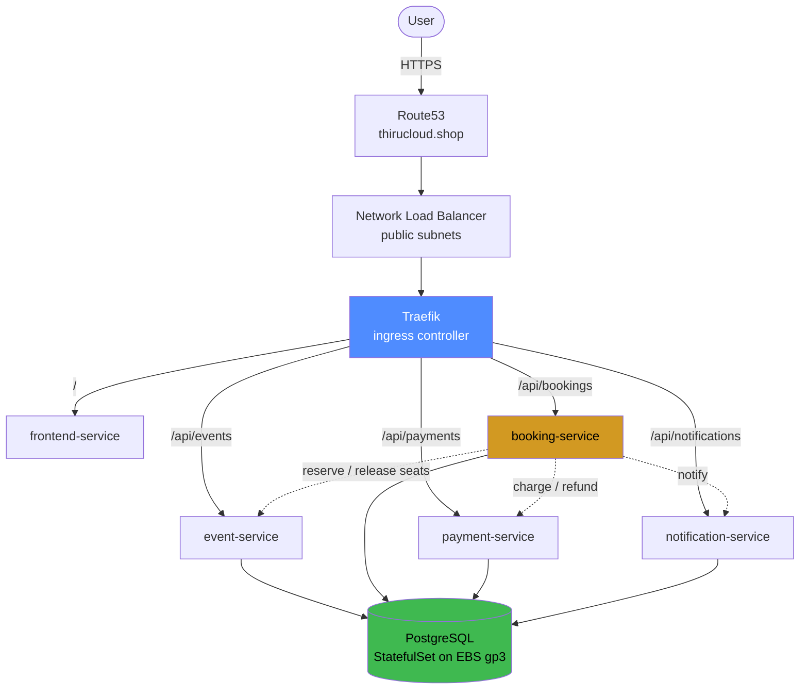

# EventHub — Event Management & Ticket Booking on EKS

A complete, working example of taking five microservices from source code to a
public HTTPS endpoint on Amazon EKS, with every piece of infrastructure defined
in Terraform.

Built as teaching material. The application is real enough to be interesting —
it has a distributed transaction, a database, and a failure path worth
demonstrating — without being so large that the infrastructure gets lost behind
it.

---

## What's here

| Layer | What it is |
|---|---|
| **Application** | Five Go services sharing one module. Distroless images, 8–12 MB each. |
| **CI** | GitHub Actions: build → Trivy scan → push to a single ECR repository. |
| **Infrastructure** | Hand-written Terraform modules, composed per environment. |
| **Environments** | `dev`, `stage`, `prod` — same modules, different tfvars. |

No community Terraform modules are used. Reading a 4,000-line general-purpose
module teaches nobody anything; every module here is small enough to read in one
sitting and commented with *why*, not *what*.

---

## Architecture



Everything from Traefik down runs on nodes in private subnets. The only things
in a public subnet are the load balancer and the NAT gateway.

### The five services

| Service | Owns | Talks to |
|---|---|---|
| `frontend-service` | The UI, compiled into the binary with `go:embed` | all four (fallback proxy) |
| `event-service` | Event catalogue and **seat inventory** | — |
| `booking-service` | The booking **saga** | event, payment, notification |
| `payment-service` | Mock gateway with reproducible declines | — |
| `notification-service` | Delivery log the UI renders as a feed | — |

**booking-service is the interesting one.** There is no distributed transaction
— there cannot be, since each service owns its own data. Instead every step that
changes remote state has a compensating action:

```
1. read the event              (no state change)
2. reserve seats               ← compensate: release
3. record a PENDING booking
4. charge the customer         ← compensate: refund
5. mark the booking CONFIRMED
6. notify the customer         (best effort — never rolls anything back)
```

Book with the payment method **"Card that always declines"** and you can watch
steps 2 and 3 unwind in the logs while the seat count returns to where it
started.

---

## Repository layout

```
.
├── services/                     five Go services, one Dockerfile each
├── internal/                     shared packages (httpx, config, logging, db, id)
├── deploy/postgres/              init script shared by compose and Kubernetes
├── scripts/smoke-test.sh         end-to-end test of the booking saga
├── docker-compose.yml            the whole stack locally, no AWS needed
├── .github/workflows/
│   ├── build-scan-push.yml       build → Trivy → ECR
│   └── terraform-validate.yml    fmt and validate, no credentials required
└── terraform/
    ├── environments/
    │   ├── dev/                  small, cheap, owns the shared hosted zone
    │   ├── stage/                production's shape at a smaller size
    │   └── prod/                 NAT per AZ, 3 nodes, pinned images
    └── modules/
        ├── vpc/                  subnets, IGW, NAT, route tables, S3 endpoint
        ├── security-groups/      load balancer, node and cluster rules
        ├── ecr/                  one repository, per-service lifecycle rules
        ├── eks/                  control plane, OIDC, node group, access entries
        ├── eks-addons/           managed add-ons + LB controller + autoscaler
        ├── irsa/                 reusable IAM-role-for-service-account
        ├── route53/              public hosted zone
        ├── cert-manager/         cert-manager + Let's Encrypt ClusterIssuers
        ├── traefik/              ingress controller, NLB and DNS record
        ├── k8s-app/              the application — one file per service
        └── github-oidc/          optional replacement for static CI keys
```

### Environments

Each environment is a **complete, independent root module** with its own state.
They share every module and differ only in `terraform.tfvars`:

| | dev | stage | prod |
|---|---|---|---|
| VPC CIDR | `10.0.0.0/16` | `10.1.0.0/16` | `10.2.0.0/16` |
| NAT gateways | 1 shared | 1 shared | **one per AZ** |
| Nodes | 2 × t3.large | 2–6 × t3.large | 3–10 × t3.large / m5.large |
| Hostname | `thirucloud.shop (apex)` | `eventhub-stage.…` | `eventhub.…` |
| TLS | **off until Phase 5**, then LE staging | on, LE production | on, LE production |
| Image tag | `latest`, pull Always | pinned SHA | **pinned SHA** |
| Log level | `debug` | `info` | `info` |
| Flow logs | off | off | **on** |
| ECR force delete | yes | yes | **no** |

One hosted zone is shared by all three, split by subdomain. **dev creates it**
(`create_route53_zone = true`); stage and prod look it up.

### The `k8s-app` module

One file per service, each completely self-contained — open
[`booking-service.tf`](terraform/modules/k8s-app/booking-service.tf) and
everything about booking-service is in front of you:

```
k8s-app/
├── namespace.tf              namespace + restricted Pod Security Standard
├── storage.tf                gp3 StorageClass (WaitForFirstConsumer)
├── postgres.tf               StatefulSet, Secret, ConfigMap, headless Service
├── locals.tf                 shared labels, image URIs, service DNS names
├── frontend-service.tf   ┐
├── event-service.tf      │   each: ConfigMap + Deployment (liveness,
├── booking-service.tf    │   readiness, startup probes) + Service + HPA
├── payment-service.tf    │   + Ingress + PodDisruptionBudget
└── notification-service.tf ┘
```

---

## Run it locally

No AWS account needed.

```bash
make up       # build and start all six containers
make smoke    # exercise the full saga, including the rollback path
make down
```

Then open <http://localhost:8080>. Backends are exposed individually for
`curl`: event `:8081`, booking `:8082`, payment `:8083`, notification `:8084`.

---

## Deploy to AWS

> 📖 **Step-by-step guides live in [`docs/aws/`](docs/aws/)** — five phases with
> prerequisites, exact commands, verification and troubleshooting for each:
>
> | Phase | Doc | What you get |
> |---|---|---|
> | 1 | [01-aws-infra.md](docs/aws/01-aws-infra.md) | VPC, security groups, ECR, Route53, EKS, IRSA, add-ons |
> | 2 | [02-traefik.md](docs/aws/02-traefik.md) | Traefik behind a Network Load Balancer |
> | 3 | [03-github-actions.md](docs/aws/03-github-actions.md) | CI: build → Trivy → ECR |
> | 4 | [04-eventhub-app-deploy.md](docs/aws/04-eventhub-app-deploy.md) | PostgreSQL on EBS and the five services |
> | 5 | [05-https.md](docs/aws/05-https.md) | GoDaddy delegation, cert-manager, HTTPS |
>
> What follows is the condensed version.

### Prerequisites

- AWS credentials with administrative access
- `terraform` ≥ 1.11, `aws` CLI v2, `kubectl`, `helm`, `docker`
- A registered domain. This repo assumes `thirucloud.shop` on GoDaddy.

Everything below defaults to `ENV=dev`. Add `ENV=stage` or `ENV=prod` to any
target to work on another environment.

### 1. Infrastructure, one module at a time

The first run of a fresh environment **must be staged**. The Kubernetes and Helm
providers are configured from the EKS module's outputs, which do not exist until
the cluster does — so targeting prunes the graph and keeps those providers out
of it until they can actually be configured.

```bash
make init

make vpc        # terraform apply -target=module.vpc
make sg         #                 -target=module.security_groups
make ecr        #                 -target=module.ecr
make dns        #                 -target=module.route53
make eks        #                 -target=module.eks            (~15 min)
make irsa       #                 -target=module.irsa_*         (4 roles)
make addons     #                 -target=module.eks_addons
```

Or run all seven in order:

```bash
make infra      # also updates your kubeconfig at the end
kubectl get nodes
```

### 2. Images

Either push to `main` and let the pipeline do it, or build locally:

```bash
make ecr-push
```

Both produce the same two tags per service in one repository:

```
<account>.dkr.ecr.<region>.amazonaws.com/eventhub:event-service-latest
<account>.dkr.ecr.<region>.amazonaws.com/eventhub:event-service-<git-sha>
```

For stage and prod, set `image_tag` in that environment's `terraform.tfvars` to
the SHA you are promoting.

### 3. Workloads

```bash
make cert-manager   # terraform apply -target=module.cert_manager
make traefik        #                 -target=module.traefik
make app            #                 -target=module.k8s_app
```

Or all three:

```bash
make apps
make status
```

From here on the environment is fully in state, so a plain `make apply` works
and is what you use for every subsequent change.

The site is reachable through the load balancer before DNS exists:

```bash
make url
terraform -chdir=terraform/environments/dev output -raw curl_check
```

### 4. DNS delegation

```bash
make nameservers
```

Set those four nameservers at GoDaddy: **My Products → thirucloud.shop → DNS →
Nameservers → Change → I'll use my own nameservers**. No trailing dot.

```bash
dig +short NS thirucloud.shop @8.8.8.8
```

### 5. TLS

Nothing to run. cert-manager is already retrying the DNS-01 challenge and
completes on its own once delegation resolves.

```bash
make cert-status
```

dev ships with `enable_tls = false` and `traefik_redirect_http_to_https = false`
so the application is reachable over plain HTTP before the domain is delegated.
Phase 5 turns both on together with cert-manager, using the **Let's Encrypt
staging** issuer first — untrusted, so the browser warns, but with effectively
unlimited rate limits while you debug DNS. Once a staging certificate reaches
`Ready=True`:

```hcl
# terraform/environments/dev/terraform.tfvars
use_letsencrypt_staging = false
```

```bash
make app
```

stage and prod ship with TLS on and production issuers, because by the time you
build them dev has proved the path works. Full detail in
[docs/aws/05-https.md](docs/aws/05-https.md).

### 6. Verify

```bash
make smoke-cluster
```

---

## Costs

Not free tier. Per environment, roughly, at `us-east-1` on-demand prices:

| Item | dev / stage | prod |
|---|---|---|
| EKS control plane | ~$73 | ~$73 |
| Nodes | ~$120 (2 × t3.large) | ~$180 (3 × t3.large) |
| NAT gateways | ~$33 (1) | ~$99 (3) |
| Network Load Balancer | ~$17 | ~$17 |
| EBS, ECR, Route53 | ~$10 | ~$20 |
| **Total** | **~$250/mo (~$8/day)** | **~$390/mo (~$13/day)** |

Ways to spend less in dev: `node_capacity_type = "SPOT"` cuts the node bill by
about 70%; `t3.medium` with `node_desired_size = 3` roughly halves it.

```bash
make destroy              # dev
make ENV=prod destroy     # asks you to type the environment name
```

Workloads are destroyed before the cluster, deliberately: the AWS Load Balancer
Controller creates an NLB that Terraform never recorded in state, so tearing
down the VPC first leaves an orphaned load balancer holding an ENI and the
destroy hangs.

---

## Reference

| Command | What it does |
|---|---|
| `make help` | Every target, with the current `ENV` |
| `make status` | Nodes, pods, services, PVCs, certificates |
| `make cert-status` | Why the certificate has or has not issued |
| `make app-logs` | Tail all five services at once |
| `make validate` | `terraform validate` all three environments, no credentials |
| `make lint` | `gofmt`, `terraform fmt` and `go vet` |
| `make test` | Go unit tests |

Further reading in [`docs/aws/`](docs/aws/) — the five-phase AWS deployment
guide, from an empty account to HTTPS. Each phase carries its own prerequisites,
verification steps and troubleshooting table.

---

## Things this project does that are worth stealing

- **Scan before push.** The image is built once, loaded locally, scanned, and
  only then tagged and pushed. The bytes that pass the scan are the bytes that
  reach ECR.
- **`ignore_changes` on anything an autoscaler owns.** Both the node group's
  `desired_size` and each Deployment's `replicas`. Without it, every apply
  silently undoes the last scaling decision.
- **Readiness and liveness probes that check different things.** Liveness never
  touches the database, so a database outage does not restart every pod at once.
- **Graceful shutdown in the application, not a `preStop` hook.** Distroless
  images have no shell to run `sleep` in. The services handle `SIGTERM`
  themselves: fail readiness, keep serving for `DRAIN_DELAY`, then exit.
- **`WaitForFirstConsumer` on the StorageClass.** An EBS volume cannot cross an
  availability zone. Binding immediately creates the volume before the scheduler
  has chosen a zone, and roughly two times in three the pod can never attach it.
- **One Ingress owns the certificate.** All five Ingresses share a host and a
  TLS Secret, but only `frontend-service` carries the cert-manager annotation.
  Annotating all five would fire five simultaneous requests for the same name
  and exhaust the rate limit for nothing.

## Things this project does that you should not copy as-is

- **Local Terraform state.** Fine for one person; switch to the S3 backend
  block already written in each environment's `backend.tf` the moment a second
  person applies.
- **Static AWS keys in CI.** Requested deliberately, with a commented OIDC
  replacement in the workflow and a ready `github-oidc` module.
- **One ECR repository for five services.** Simple to create, but scan settings,
  tag mutability and lifecycle rules are shared, and IAM cannot grant push
  access to one service without granting it to all five.
- **A single-replica PostgreSQL StatefulSet.** Correct for a workshop, wrong for
  production, where this is RDS Multi-AZ or an operator that handles failover.
- **Unpinned Helm chart versions.** Convenient while building; pin every one
  before running this in front of an audience.
- **The three `TODO` lines in `prod/terraform.tfvars`.** A public Kubernetes API
  endpoint and a load balancer open to `0.0.0.0/0` are fine for a demo and not
  for production.
