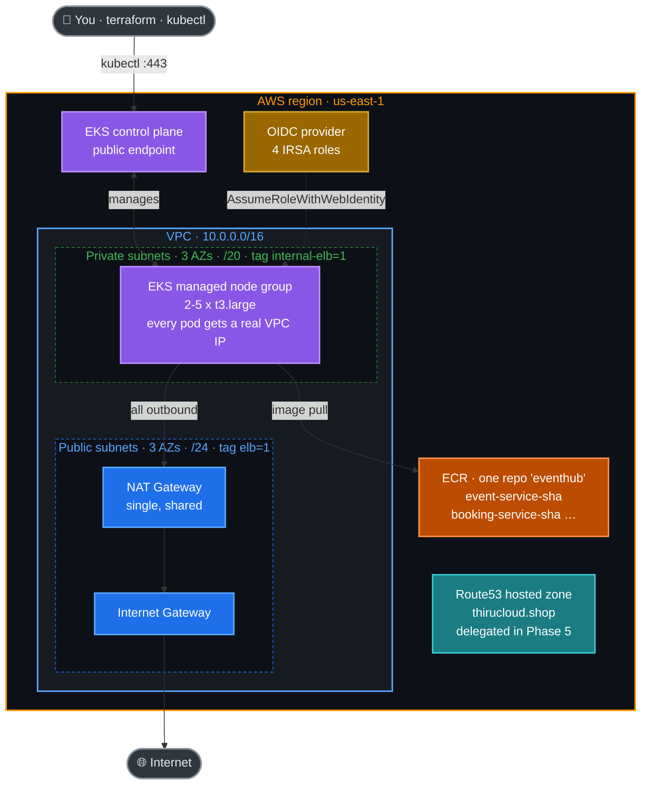

# Phase 1 — AWS Infrastructure (Terraform)

**Goal:** Provision the entire AWS foundation for EventHub with Terraform —
**VPC, security groups, ECR, Route53, EKS, IRSA, add-ons** — then connect
`kubectl` to the new **EKS cluster** and run `kubectl get nodes`.

**Time:** ~20–25 minutes (the EKS control plane alone takes ~10–15 min).

---

## What you'll build in this phase



**Key design points**

- **Single ECR repository** (`eventhub`) holds all five service images,
  distinguished by tag prefix (`event-service-<sha>`, `booking-service-<sha>`, …).
- **Nodes run in private subnets**; only the NAT gateway and load balancer live
  in public subnets.
- **IRSA (IAM Roles for Service Accounts)** is enabled via the cluster OIDC
  provider, so controllers assume least-privilege IAM roles without static keys.
  Four roles are created here: EBS CSI driver, Cluster Autoscaler, cert-manager
  and the AWS Load Balancer Controller.
- **Public, CIDR-restrictable API endpoint** — you connect directly with
  `aws eks update-kubeconfig`.
- **The whole phase is applied one module at a time** with `-target`. That is
  not a workaround for a broken config; see *Why the first apply is staged*.

---

## ✅ Prerequisites

| Tool / thing | How to check | Where to get it |
| --- | --- | --- |
| AWS account + billing enabled | `aws sts get-caller-identity` | https://portal.aws.amazon.com/billing/signup |
| IAM user/role with admin *(easy for learning)* | keys in `~/.aws/credentials` | IAM → Users → Create → access key |
| **Terraform ≥ 1.11** (needed for S3 `use_lockfile`) | `terraform -version` | https://developer.hashicorp.com/terraform/install |
| **AWS CLI v2** | `aws --version` | https://docs.aws.amazon.com/cli/latest/userguide/install |
| `kubectl` | `kubectl version --client` | https://kubernetes.io/docs/tasks/tools/ |
| `helm` (Phases 2 and 5) | `helm version` | https://helm.sh/docs/intro/install/ |
| Repo cloned locally | `ls terraform/environments/dev` | `git clone <your-repo>.git` |

> 🔑 **Authenticating Terraform.** Configure AWS creds once:
> ```bash
> aws configure   # or export AWS_ACCESS_KEY_ID / AWS_SECRET_ACCESS_KEY / AWS_REGION
> aws sts get-caller-identity   # confirm you're in the right account
> ```
> Never paste keys into chat or commits. Use a dedicated learning account and
> delete the keys after teardown.

---

## Step 0 — Remote state bucket (one-time per account)

State lives in **S3 with native lockfile locking** (`use_lockfile = true`,
Terraform ≥ 1.11) — **no DynamoDB table needed**.

> ⚠️ **`backend.tf` already names a bucket:**
> `eventhub-tfstate-015906850208`, which belongs to the account this was first
> built in. **If you are deploying into a different AWS account**, create your
> own bucket below and change the `bucket =` line in all three
> `terraform/environments/*/backend.tf` files. The bucket name is global across
> all of AWS, so it cannot be shared.

```bash
REGION=us-east-1
ACCOUNT=$(aws sts get-caller-identity --query Account --output text)
BUCKET="eventhub-tfstate-${ACCOUNT}"

# us-east-1 is the one region that must NOT get a LocationConstraint
aws s3api create-bucket --bucket "$BUCKET" --region "$REGION"

aws s3api put-bucket-versioning --bucket "$BUCKET" \
  --versioning-configuration Status=Enabled

aws s3api put-bucket-encryption --bucket "$BUCKET" \
  --server-side-encryption-configuration \
  '{"Rules":[{"ApplyServerSideEncryptionByDefault":{"SSEAlgorithm":"AES256"},"BucketKeyEnabled":true}]}'

aws s3api put-public-access-block --bucket "$BUCKET" \
  --public-access-block-configuration \
  'BlockPublicAcls=true,IgnorePublicAcls=true,BlockPublicPolicy=true,RestrictPublicBuckets=true'
```

Versioning is what makes a bad apply recoverable; the other two keep state —
which contains resource attributes in plain text — encrypted and off the public
internet.

> **Why no DynamoDB?** Before Terraform 1.11 the S3 backend could not lock on
> its own, so a DynamoDB table was required. `use_lockfile = true` now holds the
> lock as an object beside the state file. Any guide telling you to create a lock
> table predates that.

Each environment keeps its own key (`dev/`, `stage/`, `prod/`), so the three
never touch each other's state.

---

## Tour of `terraform/`

```
terraform/
├── modules/
│   ├── vpc/              # VPC, public/private subnets (3 AZs), IGW, NAT, routes, EKS subnet tags
│   ├── security-groups/  # load balancer, node and control-plane rules
│   ├── ecr/              # ONE ECR repo (tag-prefix per service) + lifecycle policy
│   ├── eks/              # cluster + managed node group + OIDC provider + access entries
│   ├── eks-addons/       # managed add-ons + AWS LB Controller + Cluster Autoscaler
│   ├── irsa/             # reusable IAM-role-for-service-account
│   ├── route53/          # public hosted zone (delegated in Phase 5)
│   ├── traefik/          # Phase 2
│   ├── k8s-app/          # Phase 4
│   ├── cert-manager/     # Phase 5
│   └── github-oidc/      # optional, replaces the CI access keys
└── environments/
    ├── dev/              # 10.0.0.0/16, single NAT, t3.large   (this doc uses dev)
    ├── stage/            # 10.1.0.0/16, single NAT
    └── prod/             # 10.2.0.0/16, one NAT per AZ, 3 nodes
```

Each environment is a root module wiring the modules together. **The three
environments are identical Terraform** — `diff dev/main.tf prod/main.tf` prints
nothing. Everything that differs lives in `terraform.tfvars`.

---

## Step 1 — Pick an environment & review variables

This walkthrough uses **`dev`**. Open
[terraform/environments/dev/terraform.tfvars](../../terraform/environments/dev/terraform.tfvars).
Sensible defaults are set; the ones you might change:

| Knob | Default | What it controls |
| --- | --- | --- |
| `aws_region` | `us-east-1` | Region for everything. `ap-south-1` is closer from India. |
| `kubernetes_version` | `1.35` | Control plane version — **read the support-status warning in Step 1a** |
| `environment` | `dev` | Name suffix — cluster becomes `eventhub-dev-eks` |
| `vpc_cidr` | `10.0.0.0/16` | VPC address space |
| `availability_zone_count` | `3` | AZs to spread subnets across |
| `node_instance_types` | `["t3.large"]` | Node size — see the sizing note below |
| `node_desired/min/max` | `2 / 2 / 5` | Managed node group autoscaling bounds |
| `single_nat_gateway` | `true` | One NAT (cheap) for dev; prod uses one per AZ |
| `ecr_repository_name` | `eventhub` | The single ECR repo all five services push to |
| `domain_name` | `thirucloud.shop` | Apex domain, delegated from GoDaddy in Phase 5 |
| `subdomain` | `""` (empty) | Empty serves the **zone apex**, `thirucloud.shop`. A name like `eventhub` would give `eventhub.thirucloud.shop`. Only one environment can own the apex. |
| `create_route53_zone` | `true` | **dev owns the shared zone**; stage/prod look it up. See the rebuild warning in Phase 5. |
| `enable_tls` | `false` | Turned on in Phase 5. Leave it alone until then. |
| `traefik_redirect_http_to_https` | `false` | Turned on in Phase 5, together with `enable_tls`. |
| `use_letsencrypt_staging` | `true` | Phase 5 flips this to `false` after a staging certificate issues. |

> ℹ️ **Those last three are the only values you change while following this
> guide**, and all three change in Phase 5. Everything else can stay as shipped.

> 💡 **Sizing reality:** `t3.large` is chosen for **pod density, not CPU**. The
> VPC CNI gives every pod a real VPC IP from the node's ENIs, and that count is
> fixed per instance type: **t3.medium allows 17 pods, t3.large 35**. EventHub
> plus its controllers is around 25 pods, so t3.medium × 2 leaves no headroom and
> the first scale-up fails with pods stuck `Pending` on *too many pods*.
> t3.medium works if you raise `node_desired_size` to 3, and costs about half.

---

## Step 1a — Check the Kubernetes version's support status ⚠️

**Do this before you apply. It is the single largest cost trap in this project.**

EKS gives each Kubernetes version ~14 months of *standard* support at
**$0.10/hour**. After that the cluster keeps running, but silently moves to
*extended* support at **$0.60/hour** — six times the price, and nothing in the
Terraform output tells you.

```bash
aws eks describe-cluster-versions --output table \
  --query 'clusterVersions[].{Version:clusterVersion,Default:defaultVersion,EndOfStandardSupport:endOfStandardSupportDate}'
```

Real output from this account, checked while writing this guide:

```
+---------+-----------------------------+-----------+
| Default |    EndOfStandardSupport     |  Version  |
+---------+-----------------------------+-----------+
|  True   |  2027-08-02                 |  1.36     |
|  False  |  2027-03-27                 |  1.35     |  <- what we use
|  False  |  2026-12-02                 |  1.34     |
|  False  |  2026-07-29                 |  1.33     |  <- already expired
|  False  |  2026-03-23                 |  1.32     |
|  False  |  2025-11-26                 |  1.31     |  <- already expired
+---------+-----------------------------+-----------+
```

**Pick a version whose `EndOfStandardSupport` is comfortably in the future.**
An expired one costs $438/month for the control plane instead of $73.

Then confirm the add-ons exist for it, because a version being *offered* does
not guarantee every add-on has caught up:

```bash
for a in vpc-cni coredns kube-proxy aws-ebs-csi-driver metrics-server; do
  printf "%-22s " "$a"
  aws eks describe-addon-versions --addon-name $a --kubernetes-version 1.35 \
    --query 'addons[0].addonVersions[0].addonVersion' --output text
done
```

Finally, **Cluster Autoscaler must match your cluster's minor version.** If you
change `kubernetes_version`, change `cluster_autoscaler_chart_version` to match:

| Kubernetes | Cluster Autoscaler chart |
| --- | --- |
| 1.31 | 9.44.0 |
| 1.32 | 9.46.6 |
| 1.33 | 9.51.0 |
| 1.34 | 9.53.0 |
| **1.35** | **9.59.0** ← current setting |

### Everything else is pinned too

`terraform.tfvars` pins all four Helm charts to versions this project was
actually deployed and verified with:

```hcl
aws_load_balancer_controller_chart_version = "3.5.0"    # installed in this phase
cluster_autoscaler_chart_version           = "9.59.0"   # installed in this phase
cert_manager_chart_version                 = "v1.21.1"  # Phase 5
traefik_chart_version                      = "41.2.0"   # Phase 2
```

Leaving any of them `null` means "latest at apply time", which is how this
project first broke: the Traefik chart had moved from 34.x to 41.x and rejected
values keys that used to be valid. Before changing one, render it against the
real chart:

```bash
helm template t traefik/traefik --version 41.2.0 -f your-values.yaml
```

---

## Why the first apply is staged

Open [terraform/environments/dev/providers.tf](../../terraform/environments/dev/providers.tf).
The Kubernetes and Helm providers are configured from `module.eks` outputs:

```hcl
provider "kubernetes" {
  host = module.eks.cluster_endpoint   # doesn't exist yet on a fresh environment
  ...
}
```

Terraform configures **every** provider before it builds the graph, so on a
brand-new environment an untargeted `terraform apply` fails: it cannot configure
a provider whose inputs are unknown.

`-target` prunes the graph. Targeting `module.vpc` means no Kubernetes resources
are in the plan, so that provider is never configured at all. Once the cluster
exists, its endpoint comes from state and a plain `terraform apply` works
normally — **the staging is only needed for the first run.**

---

## Step 2 — Init and apply, one module at a time

```bash
cd terraform/environments/dev
terraform init
```

Then, in order. Each command is a separate `terraform apply -target=…`:

```bash
terraform apply -target=module.vpc               # ~2 min  (NAT gateway is the slow part)
terraform apply -target=module.security_groups   # ~10 s
terraform apply -target=module.ecr               # ~5 s
terraform apply -target=module.route53           # ~5 s
terraform apply -target=module.eks               # ~15 min ☕ the slow step
terraform apply \
  -target=module.irsa_ebs_csi_driver \
  -target=module.irsa_cluster_autoscaler \
  -target=module.irsa_cert_manager \
  -target=module.irsa_aws_load_balancer_controller   # ~20 s
terraform apply -target=module.eks_addons        # ~5 min
```

Or use the Makefile from the repository root, which runs exactly these:

```bash
make init
make vpc && make sg && make ecr && make dns
make eks
make irsa
make addons
```

`make infra` runs all seven in sequence and updates your kubeconfig at the end.

> Add `ENV=stage` or `ENV=prod` to any make target to work on another
> environment: `make ENV=prod eks`.

### What each stage creates

| Stage | Module | Resources | Creates |
| --- | --- | ---: | --- |
| 1 | `vpc` | 25 | VPC, 3 public + 3 private subnets, IGW, NAT, route tables, S3 gateway endpoint |
| 2 | `security_groups` | 12 | Load balancer SG (80/443 in), node SG, control-plane SG |
| 3 | `ecr` | 2 | One repository + per-service lifecycle rules |
| 4 | `route53` | 1 | Public hosted zone (nothing resolves until Phase 5) |
| 5 | `eks` | 15 | Control plane, OIDC provider, launch template, managed node group, access entries, KMS key, log group |
| 6 | `irsa_*` | 11 | Four IAM roles trusted by specific Kubernetes service accounts |
| 7 | `eks_addons` | 7 | VPC CNI, CoreDNS, kube-proxy, EBS CSI, metrics-server + AWS LB Controller and Cluster Autoscaler via Helm |

The resource counts above are from a real run, so a materially different number
on your `plan` is worth a second look before you approve it.

### Useful outputs after apply

```bash
terraform output
# aws_account_id       = "118178010323"
# cluster_name         = "eventhub-dev-eks"
# cluster_endpoint     = "https://….eks.amazonaws.com"
# vpc_id               = "vpc-…"
# ecr_repository_url   = "<acct>.dkr.ecr.us-east-1.amazonaws.com/eventhub"
# nat_public_ips       = ["3.x.x.x"]
# app_fqdn             = "thirucloud.shop"
# route53_name_servers = ["ns-….awsdns-….com", …]   # 👈 for GoDaddy (Phase 5)
# installed_addons     = { "coredns" = "v1.11.…", … }
```

---

## Step 3 — Connect kubectl

```bash
aws eks update-kubeconfig --name eventhub-dev-eks --region us-east-1
# or: make kubeconfig

kubectl config current-context      # arn:aws:eks:us-east-1:…:cluster/eventhub-dev-eks
kubectl get nodes
# NAME                         STATUS   ROLES    AGE   VERSION
# ip-10-0-20-23.ec2.internal   Ready    <none>   9m    v1.35.6-eks-254016e
# ip-10-0-50-59.ec2.internal   Ready    <none>   9m    v1.35.6-eks-254016e
```

Confirm the controllers from stage 7 are running:

```bash
kubectl get pods -n kube-system
# aws-load-balancer-controller-…                Running   (x2)
# aws-node-…                                    Running   (one per node)
# cluster-autoscaler-aws-cluster-autoscaler-…   Running
# coredns-…                                     Running   (x2)
# ebs-csi-controller-…                          Running   (x2)
# ebs-csi-node-…                                Running   (one per node)
# kube-proxy-…                                  Running   (one per node)
# metrics-server-…                              Running   (x2)
```

Fifteen pods on a two-node cluster. Note the Cluster Autoscaler pod is named
`cluster-autoscaler-aws-cluster-autoscaler-…` — the chart prefixes the release
name, which matters when you write a label selector or a `kubectl logs` command.

> The EKS API endpoint is public by default. For real environments restrict it
> with `public_access_cidrs = ["<your-ip>/32"]` in `terraform.tfvars`.

---

## Step 4 — Verify IRSA is wired up

IRSA is the mechanism every controller uses to reach AWS without static keys.
Check that the annotation landed on the service accounts:

```bash
kubectl get sa ebs-csi-controller-sa -n kube-system \
  -o jsonpath='{.metadata.annotations.eks\.amazonaws\.com/role-arn}'; echo
# arn:aws:iam::<acct>:role/eventhub-dev-eks-ebs-csi-driver

kubectl get sa aws-load-balancer-controller -n kube-system \
  -o jsonpath='{.metadata.annotations.eks\.amazonaws\.com/role-arn}'; echo
```

The chain, worth understanding once:

1. EKS publishes an OIDC discovery document
2. IAM trusts that issuer (the `aws_iam_openid_connect_provider` in the `eks` module)
3. The kubelet projects a signed JWT into the pod, with the ServiceAccount as the `sub` claim
4. The AWS SDK calls `sts:AssumeRoleWithWebIdentity` and gets temporary credentials

The trust policy in [modules/irsa/main.tf](../../terraform/modules/irsa/main.tf)
pins the role to one `system:serviceaccount:<namespace>:<name>`. **Get the
namespace or name wrong and the pod starts up perfectly healthy, then fails
every AWS call with `AccessDenied`.** That is the single most common IRSA bug.

---

## Step 5 — Storage: EBS CSI driver + gp3

PostgreSQL (Phase 4) uses a `PersistentVolumeClaim`, so the cluster needs the
**EBS CSI driver** and a **gp3** StorageClass.

- **EBS CSI driver** — installed by `module.eks_addons` as a managed add-on with
  its own IRSA role. It came up in stage 7 above.
- **gp3 StorageClass** — created in Phase 4 by `module.k8s_app`
  ([storage.tf](../../terraform/modules/k8s-app/storage.tf)), because it is a
  Kubernetes object rather than an AWS one.

Verify the driver now:

```bash
kubectl get pods -n kube-system -l app.kubernetes.io/name=aws-ebs-csi-driver
kubectl get storageclass
# gp2   kubernetes.io/aws-ebs   ...   (EKS default, left alone)
```

`gp3` appears in Phase 4. It is deliberately **not** marked default — two
default StorageClasses is an error state, and workloads should name the class
they need rather than inherit whatever the cluster happens to default to.

---

## Step 6 — Smoke-test the ECR repo

Phase 3 pushes images here. Verify auth works:

```bash
ACCOUNT=$(aws sts get-caller-identity --query Account --output text)
REG=$ACCOUNT.dkr.ecr.us-east-1.amazonaws.com
aws ecr get-login-password --region us-east-1 | docker login --username AWS --password-stdin $REG

docker pull busybox:1.36
docker tag busybox:1.36 $REG/eventhub:smoke-test
docker push $REG/eventhub:smoke-test

aws ecr batch-delete-image --repository-name eventhub \
  --image-ids imageTag=smoke-test --region us-east-1
```

If you get `denied: …`, the IAM identity lacks ECR push permissions, or you
logged in to the wrong registry host.

---

## Step 7 — Note the nameservers for Phase 5

The hosted zone exists but **nothing in it resolves yet** — GoDaddy is still
authoritative for the domain. Grab the nameservers now; you will need them in
Phase 5:

```bash
terraform output -raw delegation_instructions
# or: make nameservers
```

Do **not** update GoDaddy yet. Phase 5 does that, once there is something for
the domain to point at.

---

## Cost check

| Item | Roughly |
| --- | --- |
| EKS control plane | $0.10/hr — **~$73/mo** |
| 2 × t3.large nodes | ~$120/mo |
| NAT gateway (single) | ~$33/mo |
| EBS, ECR, Route53 zone | ~$10/mo |
| **Total so far** | **~$235/mo (~$8/day)** |

The NLB from Phase 2 adds ~$17/mo.

---

## Step 8 — Destroy when done (cost discipline)

```bash
cd terraform/environments/dev
terraform destroy
# or from the repo root: make destroy
```

> ⛔ **Never run a bare `terraform destroy` on a live environment.** Use
> `make destroy`, or the two-step order below. This is not a style preference —
> a plain destroy on a fully deployed environment reliably breaks, and the
> failure is expensive to clean up:
>
> ```bash
> terraform destroy -target=module.k8s_app -target=module.traefik -target=module.cert_manager
> terraform destroy
> ```
>
> **Why.** Traefik, cert-manager and the two controllers are Helm releases, and
> **Helm can only uninstall while nodes still exist** — it needs somewhere to
> run the pods it is removing. Terraform's dependency graph does not know that.
> If the node group goes first, every `helm_release` deletion stalls, and the
> Network Load Balancer is left orphaned: it was created by the AWS Load
> Balancer Controller, never recorded in Terraform state, and the only thing
> that would delete it is now unschedulable. A live NLB holds ENIs in your
> subnets, so the VPC can never delete either.
>
> Recovering from that means deleting the load balancer by hand and dropping
> the stuck releases from state — see the troubleshooting table below.

---

## Troubleshooting

| Symptom | Likely cause | Fix |
| --- | --- | --- |
| `Invalid provider configuration` / references unknown value | You ran an untargeted `apply` on a fresh environment | Use the staged `-target` order in Step 2, or `make infra`. |
| `Error: creating EKS Cluster … AccessDenied` | IAM identity lacks EKS permissions | Use an admin identity for the apply. |
| EKS create hangs at `Still creating…` >15 min | Normal — control plane provisioning is slow | Wait; check the EKS console for an explicit error after 20 min. |
| Node group times out, `kubectl get nodes` empty | Launch template security groups | When an LT specifies SGs, EKS stops attaching the cluster SG automatically. The `eks` module concats it in — confirm with `aws ec2 describe-instances --filters "Name=tag:eks:cluster-name,Values=eventhub-dev-eks" --query 'Reservations[].Instances[].SecurityGroups'`. |
| `kubectl get nodes` → `Unauthorized` | Your identity isn't mapped to the cluster | The creating identity gets admin automatically. Use the same identity, or add ARNs to `cluster_admin_principal_arns`. |
| Nodes `NotReady` | VPC CNI / NAT egress issue | `kubectl describe node`; confirm the NAT gateway exists and private route tables point at it. |
| `metrics-server` add-on not found | Your region's catalogue lacks it | Set `enable_metrics_server = false` and install the Helm chart instead. |
| Control plane billing at $0.60/hr instead of $0.10 | Your Kubernetes version is in **extended support** | Do **Step 1a**. Upgrade `kubernetes_version` to one whose standard support has not expired, and move `cluster_autoscaler_chart_version` to match. |
| `Unsupported Kubernetes minor version update` on upgrade | EKS only upgrades one minor at a time | Step through: 1.31 → 1.32 → 1.33 … Do not skip. Easier to destroy and rebuild for a workshop. |
| Controller pod logs `AccessDenied` | IRSA namespace/service-account mismatch | Compare the `role-arn` annotation (Step 4) with the trust policy's `sub` condition. |
| `denied` pushing to ECR | Wrong login host or missing permission | Re-run `aws ecr get-login-password … \| docker login` against the right registry. |
| `terraform destroy` hangs on the VPC | An NLB is holding an ENI in your subnets | See the row below — the load balancer has almost certainly been orphaned. |
| Destroy stalls on `helm_release`, or errors on a PodDisruptionBudget | The node group was destroyed before Helm could uninstall, so the pods have nowhere to run | Recover with the four steps below, then re-run `terraform destroy`. |

### Recovering a half-finished destroy

If the node group is gone but Helm releases remain, Terraform cannot make
progress on its own. `kubectl get nodes` returning *No resources found* while
pods sit `Pending` is the signature.

```bash
# 1. Is the load balancer orphaned?
aws elbv2 describe-load-balancers --query 'LoadBalancers[].[LoadBalancerName,State.Code]' --output text

# 2. Delete it by hand — nothing in the cluster can do it now
LB=$(aws elbv2 describe-load-balancers --query 'LoadBalancers[0].LoadBalancerArn' --output text)
aws elbv2 delete-load-balancer --load-balancer-arn "$LB"

# 3. Clean up target groups it leaves behind
for tg in $(aws elbv2 describe-target-groups --query 'TargetGroups[].TargetGroupArn' --output text); do
  aws elbv2 delete-target-group --target-group-arn "$tg"
done

# 4. Drop the un-uninstallable releases from state. Safe: deleting the EKS
#    cluster removes everything inside it anyway.
terraform state rm module.traefik.helm_release.traefik
terraform state rm module.traefik.kubernetes_namespace_v1.this
terraform state rm 'module.eks_addons.helm_release.aws_load_balancer_controller[0]'
terraform state rm 'module.eks_addons.helm_release.cluster_autoscaler[0]'

terraform destroy

# 5. Finally, the database volume. The EBS CSI driver creates it, so it is not
#    in Terraform state either -- and it bills ~$0.80/month if left behind.
aws ec2 describe-volumes --filters Name=status,Values=available \
  --query "Volumes[?Tags[?Key=='ebs.csi.aws.com/cluster']].VolumeId" --output text
# aws ec2 delete-volume --volume-id vol-xxxxx
```

> Both of these — the load balancer and the volume — are orphaned by the same
> mechanism: **a controller inside the cluster created them, so Terraform never
> knew about them.** When the controller loses its nodes it cannot clean up, and
> `terraform destroy` reports success while they quietly remain. Always finish a
> teardown with a sweep:
>
> ```bash
> aws elbv2 describe-load-balancers --query 'length(LoadBalancers)' --output text
> aws ec2 describe-volumes --filters Name=status,Values=available --query 'length(Volumes)' --output text
> aws ec2 describe-addresses --query 'length(Addresses)' --output text
> ```

---

➡️ **Next:** [Phase 2 — Traefik Ingress Controller](02-traefik.md)
