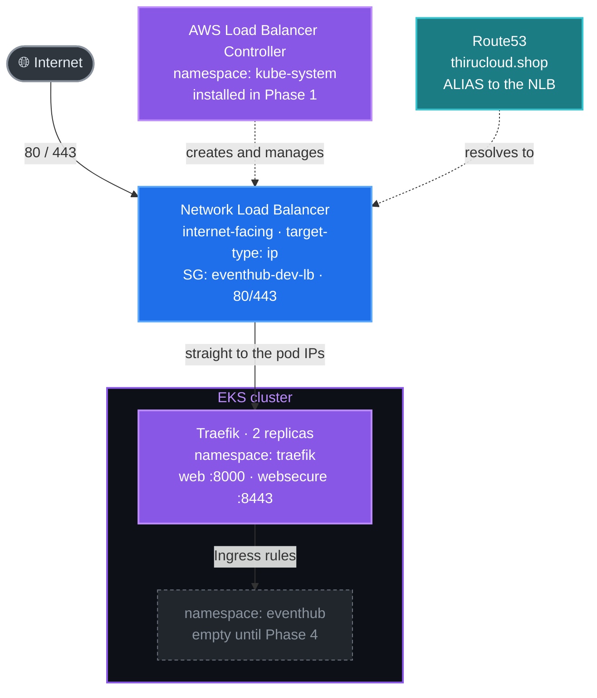

# Phase 2 — Traefik Ingress Controller (EKS)

**Goal:** Install **Traefik** in the cluster with the `traefik` Terraform module,
expose it through an **AWS Network Load Balancer (NLB)**, and publish the DNS
record that points at it. The EventHub Ingresses (Phase 4) need Traefik already
running.

**Time:** ~5 minutes (provisioning the NLB is the slow step, ~2–3 min).

---

## What is Traefik & why we use it

**Traefik** is a cloud-native edge router. Other options exist (ingress-nginx,
the AWS Load Balancer Controller's ALB ingress), but Traefik gives us:

| Feature | Why we care |
| --- | --- |
| Works with plain **`Ingress`** | Our five services use standard `networking.k8s.io/v1` Ingress objects — portable to any controller |
| Native **`IngressRoute` CRD** available | Richer matching and middleware when you want it, without forcing it |
| **Dynamic config reload** | Change a route → updates in <1s, no restart |
| **Middlewares** | CORS, basic-auth, rate-limit, strip-prefix, redirect — composable |
| **Free dashboard** | See routers, services and middlewares; debug a 404 without kubectl |

> 📌 **We deliberately use plain `Ingress`, not `IngressRoute`.** Beyond
> portability, there is a hard Terraform reason: `kubernetes_manifest` validates
> custom resources against the **live cluster during `plan`**, so it cannot
> create an object whose CRD will not exist until `apply`. A standard Ingress has
> no such problem.

---

## What this phase creates



**Why the AWS Load Balancer Controller is involved.** Traefik is the *ingress
controller* — it routes HTTP. The LB Controller is what notices a Service of
type `LoadBalancer` and builds the NLB for it, in **IP target mode** so traffic
reaches the Traefik pods directly instead of hopping through a NodePort on every
node. They are not competing; they do different jobs.

---

## ✅ Prerequisites

| Need | How to check |
| --- | --- |
| Phase 1 complete (EKS up, kubeconfig set) | `kubectl get nodes` shows Ready nodes |
| AWS Load Balancer Controller running | `kubectl get deploy -n kube-system aws-load-balancer-controller` |
| Public subnets tagged for ELBs | the `vpc` module sets `kubernetes.io/role/elb=1` |
| Route53 hosted zone exists | `terraform output route53_zone_id` |

---

## Step 1 — Review the module inputs

Open [terraform/environments/dev/main.tf](../../terraform/environments/dev/main.tf)
and find the `traefik` block:

```hcl
module "traefik" {
  source = "../../modules/traefik"

  chart_version                   = var.traefik_chart_version
  replicas                        = var.traefik_replicas
  load_balancer_security_group_id = module.security_groups.load_balancer_security_group_id

  redirect_http_to_https = var.traefik_redirect_http_to_https

  dns_zone_id = module.route53.zone_id
  hostnames   = [local.app_fqdn]

  depends_on = [module.eks_addons]
}
```

The knobs that matter in `terraform.tfvars`:

| Knob | dev default | What it controls |
| --- | --- | --- |
| `traefik_replicas` | `2` | Two pods, so ingress survives a node drain |
| `traefik_redirect_http_to_https` | **`false`** | See the warning below |
| `traefik_chart_version` | `null` (latest) | **Pin this** before a live session |

> ⚠️ **Leave `traefik_redirect_http_to_https = false` for now.** With the
> redirect on and no certificate yet, every plain HTTP request answers `308`
> pointing at `https://thirucloud.shop` — a name that does not
> resolve until Phase 5. You would have no way to reach the application through
> the load balancer hostname. Phase 5 turns it on together with TLS.

### Pin the chart version

```bash
helm repo add traefik https://traefik.github.io/charts
helm repo update traefik
helm search repo traefik/traefik
# NAME            CHART VERSION   APP VERSION
# traefik/traefik 41.2.0          v3.7.10
```

`terraform.tfvars` already pins the version this project was tested against:

```hcl
traefik_chart_version = "41.2.0"
```

> ⚠️ **This is not optional, and here is the proof.** Traefik chart 40+ ships a
> `values.schema.json` that **rejects unknown keys outright**. The chart also
> renamed its logging keys — `logs.general.level` became `log.level`, and
> `logs.access.enabled` became a top-level `accessLog.enabled`. An unpinned
> release therefore does not degrade gracefully, it fails hard:
>
> ```
> Error: values don't meet the specifications of the schema(s):
>   traefik: at '': additional properties 'logs' not allowed
> ```
>
> Because the module sets `atomic = true`, Helm rolls the whole release back and
> Terraform reports a failed apply. This project was bitten by exactly this
> during its first real deployment. Pin the version, and re-test with
> `helm template` before you change it.

---

## Step 2 — Apply the module

```bash
cd terraform/environments/dev
terraform apply -target=module.traefik
```

or from the repository root:

```bash
make traefik
```

Terraform will:

1. create the `traefik` namespace
2. install the Helm release, waiting up to 15 minutes for it to be ready — which
   for a `LoadBalancer` Service means waiting until AWS reports the NLB's DNS name
3. read that hostname back out of the Service
4. create a Route53 **ALIAS** record for `thirucloud.shop` pointing at it

That last step is why the DNS record lives in this module rather than the
`route53` one: the hostname does not exist until Helm has finished. Whatever
owns the endpoint should own the name that points at it.

> 💡 **Why ALIAS records and not CNAMEs.** This project serves the application
> from the **zone apex** (`thirucloud.shop`, no subdomain), and **a CNAME is
> illegal at an apex** — DNS requires the apex to hold SOA and NS records, and a
> CNAME cannot coexist with other record types at the same name.
>
> Route53's ALIAS is an AWS extension that solves it: it behaves like a CNAME but
> resolves inside Route53 and returns A records, so it is legal at the apex. It
> also costs nothing to query and needs no TTL.
>
> Confirm the apex holds an `A` record living happily alongside `NS` and `SOA`:
>
> ```bash
> ZONE=$(terraform output -raw route53_zone_id)
> aws route53 list-resource-record-sets --hosted-zone-id "$ZONE" \
>   --query "ResourceRecordSets[?Name=='thirucloud.shop.'].[Type]" --output text
> # A
> # NS
> # SOA
> ```
>
> Because the load balancer is created by the controller and not by Terraform,
> the module finds it by the tags the controller stamps on it
> (`elbv2.k8s.aws/cluster` and `service.k8s.aws/stack`) in order to read its
> canonical hosted zone ID.
>
> Set `subdomain = ""` in `terraform.tfvars` for the apex, or a name like
> `"eventhub"` for a subdomain. **Only one environment can own the apex** — stage
> and prod therefore keep subdomains.

---

## Step 3 — Verify

```bash
# Helm release
helm list -n traefik
# NAME     NAMESPACE  REVISION  STATUS    CHART            APP VERSION
# traefik  traefik    1         deployed  traefik-41.2.0   v3.7.10

# Pods
kubectl -n traefik get pods
# 2 traefik-… pods, Running 1/1

# Service — the NLB hostname appears once AWS finishes provisioning
kubectl -n traefik get svc traefik
# NAME     TYPE           EXTERNAL-IP                                    PORT(S)
# traefik  LoadBalancer   k8s-traefik-…-….elb.us-east-1.amazonaws.com    80:3xxxx/TCP,443:3xxxx/TCP

# CRDs installed (available if you ever want IngressRoute)
kubectl get crd | grep traefik.io
```

Save the hostname — later steps reference it:

```bash
NLB=$(kubectl -n traefik get svc traefik -o jsonpath='{.status.loadBalancer.ingress[0].hostname}')
echo "Traefik NLB: $NLB"

# Terraform knows it too:
terraform output -raw load_balancer_hostname
```

Confirm the NLB really is an NLB in IP mode, with our security group attached:

```bash
aws elbv2 describe-load-balancers \
  --query 'LoadBalancers[?contains(DNSName, `traefik`)].{Name:LoadBalancerName,Type:Type,Scheme:Scheme,SGs:SecurityGroups}' \
  --output table
# Type: network · Scheme: internet-facing · SGs: [sg-… eventhub-dev-lb]
```

---

## Step 4 — Wait for the NLB, then probe it (expect 404)

`terraform apply` returns as soon as the Service has a hostname, but **AWS is
still building the load balancer at that point.** Curl too early and you get no
answer at all, which looks like a failure and is not. Wait for it properly:

```bash
ARN=$(aws elbv2 describe-load-balancers \
  --query "LoadBalancers[?DNSName=='${NLB}'].LoadBalancerArn" --output text)

aws elbv2 wait load-balancer-available --load-balancer-arns "$ARN"
```

That returns when the state flips `provisioning` → `active`, usually 2-3 minutes
after the apply finishes. Confirm:

```bash
aws elbv2 describe-load-balancers --load-balancer-arns "$ARN" \
  --query 'LoadBalancers[0].{Type:Type,Scheme:Scheme,State:State.Code}' --output text
# network   internet-facing   active
```

Now probe it:

```bash
curl -sI -o /dev/null -w "%{http_code}\n" "http://${NLB}/"
# 404
```

A `404` is **the correct answer** for this phase: the NLB reached Traefik, and
Traefik has no route matching that request. The application's Ingresses arrive
in Phase 4.

A hang or `000` means the load balancer is still provisioning — go back to the
`wait` command above.

---

## Step 5 — Reach the Traefik dashboard

The dashboard is not exposed publicly by this module. Reach it with a port
forward, which needs no ingress and no credentials:

```bash
kubectl -n traefik port-forward deploy/traefik 9000:9000
```

Open <http://localhost:9000/dashboard/> — **the trailing slash is required.**

- **Routers** — every route Traefik knows about (empty until Phase 4)
- **Services** — the backends it forwards to
- **Middlewares** — none until you add them

> ⚠️ **Production note:** if you ever expose the dashboard through an Ingress,
> put basic-auth or an IP allowlist in front of it. Port-forwarding avoids the
> question entirely.

---

## Step 6 — NLB hostname stability

An NLB gives you a **stable DNS hostname** that does not change on its own, so
the Route53 record created in Step 2 keeps working.

The hostname **only changes if the Traefik Service is deleted and recreated** —
a fresh NLB gets provisioned. So:

- **`helm upgrade` in place is fine.** `terraform apply -target=module.traefik`
  keeps the same NLB.
- If you *do* destroy and recreate Traefik, re-apply the module so Terraform
  updates the Route53 record to the new hostname:
  ```bash
  terraform apply -target=module.traefik
  ```

Because the record is Terraform-managed, this is one command rather than a
console edit — and `terraform plan` will show you the change before you make it.

---

## What's next

Traefik is running and has a public endpoint. The next phases add **what to
route**:

- **Phase 3** — CI builds the five images and pushes them to ECR
- **Phase 4** — deploy EventHub; its Ingresses attach to this Traefik
- **Phase 5** — delegate the domain and turn on HTTPS

---

## Troubleshooting

| Symptom | Likely cause | Fix |
| --- | --- | --- |
| `EXTERNAL-IP <pending>` for >5 min | LB Controller not running, or it lacks permissions | `kubectl logs -n kube-system -l app.kubernetes.io/name=aws-load-balancer-controller --tail=50` |
| Controller logs `unable to discover subnets` | Public subnets missing `kubernetes.io/role/elb=1` | The `vpc` module sets it — confirm the tags on the public subnets. |
| Controller logs `AccessDenied` | IRSA not wired up | `kubectl get sa aws-load-balancer-controller -n kube-system -o yaml \| grep role-arn` and compare with the role's trust policy. |
| A **Classic ELB** appeared instead of an NLB | The `aws-load-balancer-type: external` annotation was lost | It is set by the module — check `kubectl -n traefik get svc traefik -o yaml`. |
| NLB is **internal**, not internet-facing | Scheme annotation or subnet tags | The module sets `scheme=internet-facing`; verify the public subnet tags. |
| `curl http://<NLB>/` → `Connection refused` | Traefik pods not Ready → no healthy targets | `kubectl -n traefik get pods`, then `describe`/`logs` the failing pod. |
| `curl` returns `308` to an https URL | `traefik_redirect_http_to_https = true` too early | Set it back to `false` until Phase 5, and re-apply. |
| Terraform hangs on `helm_release.traefik` | Waiting for the NLB to go active | Normal for 2–3 min. Past 15 min the release rolls back (`atomic = true`); check the controller logs. |
| `aws_route53_record` not created | Hostname was empty when Terraform read the Service | Re-run `terraform apply -target=module.traefik`; the data source re-reads it. |
| `helm install` → `resource mapping not found` | Stale Traefik CRDs from an earlier install | `kubectl get crd \| grep traefik.io` and delete the stale ones — ⚠️ only on a cluster you are willing to disrupt. |
| `Error: values don't meet the specifications of the schema` | Chart 40+ rejects unknown values keys, and several were renamed | Pin `traefik_chart_version` to a version you have tested. Verify values before upgrading: `helm template t traefik/traefik --version <v> -f your-values.yaml`. |
| `Error: Invalid for_each argument … will be known only after apply` | A `for_each` keyed on something that does not exist until apply | Terraform needs for_each **keys** at plan time; unknown **values** are fine. Key on a static input and move the unknown into an attribute. Fixed in this module's `aws_route53_record.app`. |
| `curl` to the NLB hangs or returns `000` | The load balancer is still `provisioning` | `aws elbv2 wait load-balancer-available` — see Step 4. The Service reports a hostname several minutes before AWS serves traffic on it. |

---

➡️ **Next:** [Phase 3 — GitHub Actions CI](03-github-actions.md)
