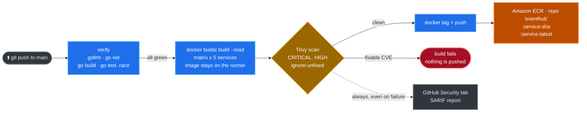

# Phase 3 — CI with GitHub Actions (→ Amazon ECR)

**Goal:** On every push to `main`, **build → scan → push** all five service
images to a single **Amazon ECR** repository. Terraform (Phase 4) does the
deploy — this pipeline never runs `helm` or `kubectl` and never touches the
cluster.

**Time:** ~10 minutes to configure (IAM user + repo secrets); builds run on push.

Workflow files:
[.github/workflows/build-scan-push.yml](../../.github/workflows/build-scan-push.yml)
(build/scan/push) and
[.github/workflows/terraform-validate.yml](../../.github/workflows/terraform-validate.yml)
(`fmt`/`validate` for the Terraform).

---

## Why it's built this way

| Decision | Why |
| --- | --- |
| **CI has no cluster credentials** | It pushes images and stops. Terraform deploys. A leaked CI key cannot reach the cluster. |
| **Single ECR repo, tag-prefix per service** (`eventhub:event-service-<sha>`) | One repo to manage, scan and set lifecycle rules on, instead of five |
| **Matrix build** (5 services in parallel) | Whole platform rebuilt predictably; a change in `internal/` rebuilds all five |
| **Build once → scan → push the same image** | The bytes that pass the scan are the bytes that reach ECR |
| **Trivy as a hard gate** (`exit-code: 1`) | CRITICAL/HIGH with an available fix fails the build |
| **`ignore-unfixed: true`** | A CVE with no published fix cannot be resolved by rebuilding; blocking on it just teaches people to disable the gate |
| **Static IAM access keys** | Simplest to wire up. The CI user holds **only** an ECR-push policy. An OIDC upgrade is documented at the end. |

---

## Pipeline overview



**The ordering is the point.** The image is built once and *loaded into the
local Docker daemon* — not pushed. Trivy scans it there. Only then is it tagged
and pushed. Building a second time for the push would mean shipping an image
that was never scanned.

---

## ✅ Prerequisites

| Need | How to check / get |
| --- | --- |
| ECR repo `eventhub` exists (Phase 1) | `aws ecr describe-repositories --repository-names eventhub` |
| The registry host for the `ECR_REGISTRY` variable | `terraform -chdir=terraform/environments/dev output -raw ecr_repository_url \| cut -d/ -f1` |
| Repo pushed to GitHub | `git remote -v` |
| `aws` CLI configured (admin, for the one-time IAM setup) | `aws sts get-caller-identity` |

---

## Step 1 — Create an IAM user for CI (ECR push only)

CI authenticates with **static access keys**. Give the user *only* ECR push
permission on the one repository — nothing else.

```bash
REGION=us-east-1
ACCOUNT=$(aws sts get-caller-identity --query Account --output text)

# 1a. Create the CI user
aws iam create-user --user-name eventhub-ci

# 1b. Write a least-privilege push policy
cat > /tmp/eventhub-ecr-push.json <<EOF
{
  "Version": "2012-10-17",
  "Statement": [
    {
      "Sid": "GetAuthorizationToken",
      "Effect": "Allow",
      "Action": "ecr:GetAuthorizationToken",
      "Resource": "*"
    },
    {
      "Sid": "PushToEventHubRepository",
      "Effect": "Allow",
      "Action": [
        "ecr:BatchCheckLayerAvailability",
        "ecr:BatchGetImage",
        "ecr:CompleteLayerUpload",
        "ecr:DescribeImages",
        "ecr:DescribeRepositories",
        "ecr:GetDownloadUrlForLayer",
        "ecr:InitiateLayerUpload",
        "ecr:PutImage",
        "ecr:UploadLayerPart"
      ],
      "Resource": "arn:aws:ecr:${REGION}:${ACCOUNT}:repository/eventhub"
    }
  ]
}
EOF

# 1c. Create and attach it
POLICY_ARN=$(aws iam create-policy \
  --policy-name eventhub-ci-ecr-push \
  --policy-document file:///tmp/eventhub-ecr-push.json \
  --query 'Policy.Arn' --output text)

aws iam attach-user-policy --user-name eventhub-ci --policy-arn "$POLICY_ARN"

# 1d. Mint an access key — the secret is shown ONCE
aws iam create-access-key --user-name eventhub-ci
```

Note the `AccessKeyId` and `SecretAccessKey`. `ecr:GetAuthorizationToken` has to
be `Resource: "*"` — it is an account-level call, not a per-repository one.
Everything that actually moves bytes is scoped to the single repository.

> 🔒 The `github-oidc` Terraform module creates this same policy without any
> long-lived key. See *Upgrading to OIDC* at the end.

---

## Step 2 — Configure GitHub repo secrets

**Settings → Secrets and variables → Actions**

Two **secrets** on the *Secrets* tab:

| Name | Value |
| --- | --- |
| `AWS_ACCESS_KEY_ID` | from Step 1d |
| `AWS_SECRET_ACCESS_KEY` | from Step 1d |

Three **variables** on the *Variables* tab:

| Name | Value | Get it with |
| --- | --- | --- |
| `AWS_REGION` | `us-east-1` | must match Phase 1 |
| `ECR_REGISTRY` | `<account>.dkr.ecr.us-east-1.amazonaws.com` | see below |
| `ECR_REPOSITORY` | `eventhub` | `terraform output -raw ecr_repository_name` |

```bash
# ECR_REGISTRY — the host part, without the /eventhub suffix
terraform -chdir=terraform/environments/dev output -raw ecr_repository_url | cut -d/ -f1
# 118178010323.dkr.ecr.us-east-1.amazonaws.com
```

**Why variables and not hardcoded `env`.** Pointing the pipeline at a different
account, region or registry becomes a change in the GitHub UI rather than a
commit and a review. The workflow composes them once:

```yaml
env:
  AWS_REGION:     ${{ vars.AWS_REGION }}
  ECR_REGISTRY:   ${{ vars.ECR_REGISTRY }}
  ECR_REPOSITORY: ${{ vars.ECR_REPOSITORY }}
  IMAGE_PREFIX:   ${{ vars.ECR_REGISTRY }}/${{ vars.ECR_REPOSITORY }}
  GO_VERSION:     "1.26.5"
```

`GO_VERSION` stays in the workflow rather than becoming a variable — it must
match `ARG GO_VERSION` in `services/*/Dockerfile`, and two places that must
agree are better kept in the repository where a diff shows both.

> ⚠️ **Pin the patch version, not just the minor.** The Go standard library is
> compiled into the binary, so its CVEs are your image's CVEs and Trivy reports
> them against `stdlib`. A floating `1.26` tag resolves to whatever patch is
> current — during this project's first scan that was 1.26.4, which still
> carried a HIGH. 1.26.5 cleared it.

> ℹ️ **Secrets vs variables.** Variables are printed in logs by design — they
> are configuration, not credentials. Only the two AWS keys belong under
> Secrets, where GitHub masks them in output.

> ⚠️ **An unset variable expands to an empty string, not an error.** Without a
> guard, a missing `ECR_REGISTRY` would push to `/eventhub:...` and fail with an
> opaque authentication error. The `verify` job therefore checks all three up
> front and fails in seconds:
>
> ```
> Error: Repository variable ECR_REGISTRY is not set
> Error: Set them under Settings -> Secrets and variables -> Actions -> Variables
> ```
>
> The push step additionally asserts that `ECR_REGISTRY` matches the registry the
> credentials actually authenticated to, which catches a variable pointing at
> another account.

---

## Step 3 — How the `verify` job works

Runs once, before any container build:

| Step | What it does |
| --- | --- |
| **Check formatting** | `gofmt -l .` — fails if anything is unformatted |
| **go vet** | Static analysis across all packages |
| **go build** | Every service compiles |
| **go test -race** | Unit tests, including a concurrency test that proves seats cannot be oversold |

Five container builds take a few minutes each. Catching a compile error here
saves all of that.

---

## Step 4 — How the `build-scan-push` job works

One matrix leg per service, all five in parallel, `fail-fast: false` so one
service's scan failure does not hide the other four.

| Step | What it does |
| --- | --- |
| **Compute image tags** | `<service>-<sha>` and `<service>-latest` |
| **Build image** | Buildx with `load: true, push: false` and GHA layer cache scoped per service |
| **Trivy scan (gate)** | `CRITICAL,HIGH`, `ignore-unfixed: true`, `exit-code: 1` — **fails the job** |
| **Trivy scan (SARIF)** | `if: always()`, `exit-code: 0` — so the report exists even when the gate failed |
| **Upload SARIF artifact** | The report is always downloadable from the run, on any plan |
| **Upload SARIF to Security tab** | Best effort, `continue-on-error` — see the note below |
| **Configure AWS credentials** | Only on `push` to `main` or a manual dispatch — never on a pull request |
| **Login to ECR / tag / push** | Pushes both tags for the scanned image |
| **Job summary** | Image URI and digest in the run summary |

Image naming — single repo, tag prefix per service:

```
<account>.dkr.ecr.us-east-1.amazonaws.com/eventhub:event-service-<sha>
                                                  :event-service-latest
```

> ⚠️ **Code scanning on a private repository requires GitHub Advanced
> Security.** Without it, the Security-tab upload fails with
> `Resource not accessible by integration`, which says nothing about your
> images. The step is therefore marked `continue-on-error: true` — the security
> decision is made by the **gate** step, which fails the job by itself when it
> finds a fixable CRITICAL or HIGH.
>
> The report is also uploaded as a normal build artifact, so the findings are
> always retrievable from the run page regardless of plan or visibility.
>
> The workflow additionally needs `actions: read`, because
> `codeql-action/upload-sarif` calls
> `GET /repos/{owner}/{repo}/actions/runs/{id}` to attach results to the run.

> 🔒 **Pull requests build and scan but never push.** The credential steps are
> guarded with `if: github.event_name == 'push' || …`, so a PR from a fork can
> never reach your AWS keys.

**Single-architecture on purpose.** A multi-arch manifest cannot be loaded into
the local Docker daemon, which would force push-before-scan. EKS nodes here are
x86_64, so `linux/amd64` is all we need.

---

## Step 5 — Trigger and watch

```bash
git commit --allow-empty -m "ci: trigger"
git push origin main
```

Watch the **Actions** tab: `verify` first, then five parallel service jobs.

Verify the images landed:

```bash
aws ecr list-images --repository-name eventhub --region us-east-1 \
  --query 'imageIds[].imageTag' --output table | head -20
```

You should see ten tags — a `-latest` and a `-<sha>` for each of the five
services.

### Building without the pipeline

Same result, from your laptop:

```bash
make ecr-push
```

It builds all five, tags them `-latest` and `-<git sha>`, and pushes. Useful
when you are iterating and do not want to wait on CI.

---

## Step 6 — Choose the tag Phase 4 deploys

Phase 4 reads `image_tag` from the environment's `terraform.tfvars` and appends
it to each service name:

```hcl
# terraform/environments/dev/terraform.tfvars
image_tag = "latest"        # → eventhub:event-service-latest
```

- **dev** tracks `latest` with `image_pull_policy = "Always"`, so a restarted pod
  picks up the newest push.
- **stage and prod** should pin a commit SHA:
  ```hcl
  image_tag = "3f9a1c2e8b7d6f5a4c3b2a1908f7e6d5c4b3a291"
  ```
  `latest` is a moving target — a pod restarted at 3am can quietly come back on
  different code than its siblings.

---

## Upgrading to OIDC (no long-lived keys)

Static keys work but never expire. GitHub can instead mint a short-lived token
per workflow run that AWS trades for temporary credentials. Nothing long-lived
exists to leak or rotate.

The Terraform module is already written and switched off:

```hcl
# terraform/environments/dev/terraform.tfvars
enable_github_oidc          = true
github_oidc_create_provider = true     # only ONE environment may create it
github_owner                = "vijaygiduthuri"
github_repository           = "EventHub-Terraform-EKS"
```

```bash
terraform apply -target=module.github_oidc
terraform output -raw github_actions_role_arn
```

Then in the workflow:

1. add `id-token: write` to the top-level `permissions:` block
2. replace the credentials step:
   ```yaml
   - name: Configure AWS credentials
     uses: aws-actions/configure-aws-credentials@v4
     with:
       role-to-assume: arn:aws:iam::<account>:role/eventhub-dev-github-actions
       aws-region: ${{ env.AWS_REGION }}
   ```
3. delete both repository secrets, and `aws iam delete-user --user-name eventhub-ci`

The commented block at the bottom of
[build-scan-push.yml](../../.github/workflows/build-scan-push.yml) has the same
instructions inline.

---

## Troubleshooting

| Symptom | Likely cause | Fix |
| --- | --- | --- |
| `Resource not accessible by integration` on the SARIF upload | Private repo without GitHub Advanced Security, or missing `actions: read` | Both handled: the permission is granted and the step is `continue-on-error`. Download the SARIF from the run's Artifacts instead. |
| `Repository variable X is not set` | A variable is missing from the Variables tab | Add all three from Step 2. This is the guard failing fast, on purpose. |
| `ECR_REGISTRY variable is '…' but these credentials authenticate to '…'` | The variable points at a different account | Fix `ECR_REGISTRY` to match the account the secrets belong to. |
| `denied: not authorized to perform: ecr:...` | CI user lacks the push policy | Re-run Step 1c; confirm with `aws iam list-attached-user-policies --user-name eventhub-ci`. |
| `no basic auth credentials` on push | ECR login step skipped, or AWS creds missing | Confirm both repository secrets exist and are spelled exactly as in Step 2. |
| `repository … does not exist` | ECR repo missing, or wrong region | Apply Phase 1's `module.ecr`; check `AWS_REGION` in the workflow matches. |
| Job fails at the Trivy gate | A fixable CRITICAL/HIGH in a dependency | Read the `Fixed Version` column and upgrade to at least that. `go get <module>@latest && go mod tidy`, then rebuild. To unblock temporarily, run the workflow manually with `fail_on_vulnerabilities: false`. |
| Trivy flags `stdlib` | The Go standard library is compiled into the binary, so **its CVEs are your image's CVEs** | Raise `ARG GO_VERSION` in `services/*/Dockerfile`. Pin the **patch** version: a floating `1.26` tag resolves to whatever is current and may still be vulnerable. |
| Vulnerabilities in a package you never call | Trivy reports Go findings per **module**, not per function | Upgrade anyway — it is usually a one-line change. Ten of this project's findings were in `golang.org/x/crypto/ssh`, which the application never imports; a pgx upgrade removed the module from the graph entirely. |
| Trivy fails with a rate-limit error | Its vulnerability DB is pulled from ghcr.io | The workflow already caches the DB; re-run the job. |
| `Unable to resolve action aquasecurity/trivy-action@0.28.0` | The action retagged its releases with a `v` prefix and **deleted the unprefixed tags** | Use a `v`-prefixed tag: `aquasecurity/trivy-action@v0.36.0`. Check what exists with `curl -s https://api.github.com/repos/aquasecurity/trivy-action/releases \| grep tag_name`. |
| Pull request job fails at "Configure AWS credentials" | It should be skipped on PRs | Check the `if:` guard was not removed; PRs must not reach credentials. |
| Buildx cache misses every run | First run, or cache eviction | Normal on the first build; later runs reuse `scope=<service>`. |
| Pushed images but pods still run old code | dev uses the mutable `latest` tag | Set `image_pull_policy = "Always"` (dev already does) and `kubectl rollout restart deploy -n eventhub`. |

---

➡️ **Next:** [Phase 4 — Deploy EventHub](04-eventhub-app-deploy.md)
