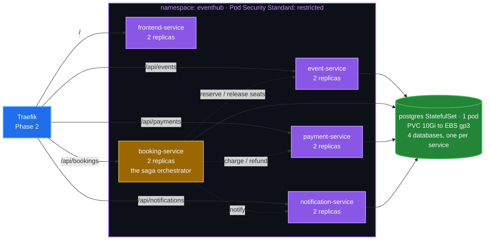

# Phase 4 — Deploy EventHub (Terraform `k8s-app` module)

**Goal:** Deploy the whole EventHub application to EKS with the `k8s-app`
Terraform module — **PostgreSQL on EBS, all five services, their Ingresses and
HPAs** — then book a ticket end to end over plain HTTP through the Traefik load
balancer. HTTPS comes in Phase 5.

**Time:** ~8 minutes (the PostgreSQL volume and first pull are the slow parts).

---

## What this phase creates



Per service, six Kubernetes objects: **ConfigMap, Deployment** (liveness +
readiness + startup probes), **Service, HorizontalPodAutoscaler, Ingress,
PodDisruptionBudget**.

**Key design points**

- **One Terraform file per service.** Open
  [booking-service.tf](../../terraform/modules/k8s-app/booking-service.tf) and
  everything about that service is in one place — no jumping between a generic
  module and five sets of inputs.
- **A database per service on one PostgreSQL server.** Services stay independent
  at the data level without paying for four database servers. The boundary that
  matters is *no service reads another service's tables*, not *no service shares
  a host*.
- **Secrets never appear in a Deployment.** The connection string lives in a
  Secret; the Deployment holds only a `secretKeyRef`.
- **The namespace enforces the `restricted` Pod Security Standard.** Every
  workload already runs as non-root with all capabilities dropped, so this costs
  nothing and turns a future careless `privileged: true` into a rejected pod.

---

## ✅ Prerequisites

| Need | How to check |
| --- | --- |
| Phase 1 complete (cluster + EBS CSI add-on) | `kubectl get pods -n kube-system \| grep ebs-csi` |
| Phase 2 complete (Traefik + NLB) | `kubectl -n traefik get svc traefik` shows an EXTERNAL-IP |
| Phase 3 complete (images in ECR) | `aws ecr list-images --repository-name eventhub --query 'imageIds[].imageTag' --output table` |

---

## Step 1 — Confirm the image tag

The module builds each image URI as
`<ecr_repository_url>:<service>-<image_tag>`. Check what Phase 3 pushed and what
this environment will deploy:

```bash
cd terraform/environments/dev
grep image_tag terraform.tfvars
# image_tag = "latest"

terraform output image_uris
# {
#   "booking-service"      = "<acct>.dkr.ecr.us-east-1.amazonaws.com/eventhub:booking-service-latest"
#   ...
# }
```

If ECR has no `-latest` tags, go back to Phase 3 or run `make ecr-push`.

---

## Step 2 — Review the scaling and app knobs

In [terraform/environments/dev/terraform.tfvars](../../terraform/environments/dev/terraform.tfvars):

| Knob | dev default | What it controls |
| --- | --- | --- |
| `app_namespace` | `eventhub` | Namespace for everything in this phase |
| `image_tag` | `latest` | Tag suffix per service |
| `image_pull_policy` | `Always` | dev tracks a mutable tag, so re-pull on restart |
| `app_replicas` | `2` | Starting replicas per service |
| `enable_hpa` | `true` | Needs metrics-server (Phase 1) |
| `hpa_min_replicas` / `hpa_max_replicas` | `2` / `6` | Autoscaling bounds |
| `log_level` | `debug` | dev is chatty; stage/prod use `info` |
| `payment_failure_rate_percent` | `0` | Raise to demo the saga compensating |
| `postgres_storage_size` | `10Gi` | Size of the EBS volume |
| `enable_tls` | **`false`** | Stays false until Phase 5 |

> ⚠️ **`enable_tls` must still be `false` here.** With it on, the Ingresses route
> through the HTTPS entrypoint and reference a certificate that does not exist
> yet — leaving you no way to reach the app before DNS is delegated. Phase 5
> turns it on.

---

## Step 3 — Apply the module

```bash
cd terraform/environments/dev
terraform apply -target=module.k8s_app
```

or from the repository root:

```bash
make app
```

A full apply creates **37 resources**. In dependency order:

1. the `eventhub` namespace
2. the **gp3 StorageClass**
3. the PostgreSQL Secret (with a generated 24-character password), the init
   ConfigMap, the headless Service and the StatefulSet
4. the four backend services, then `frontend-service`
5. one Ingress per service

The StatefulSet is the slow part — the EBS volume has to be created, attached,
formatted, and `initdb` has to run. The module allows 10 minutes.

---

## Step 4 — Watch the storage chain

This is the clearest demonstration of `WaitForFirstConsumer` and worth watching
live:

```bash
kubectl get pvc -n eventhub -w
```

The sequence:

| Stage | What you see |
| --- | --- |
| PVC created | `Pending` — *waiting for first consumer to be created* |
| Pod scheduled | Scheduler picks a node, say in `us-east-1b` |
| CSI driver acts | Calls `ec2:CreateVolume` **in that zone**, using its IRSA role |
| PV bound | PVC goes `Bound`; `kubectl get pv` shows a new volume |
| Pod starts | `postgres-0` becomes Ready |

```bash
kubectl get pv
kubectl describe pod postgres-0 -n eventhub | grep -A3 'Node:'
```

> 💡 **Why not `Immediate` binding?** It creates the EBS volume as soon as the
> PVC appears, in whatever zone the CSI controller happens to pick — and an EBS
> volume cannot cross availability zones. If the scheduler then places the pod in
> a different zone, it can never attach, and the pod sits `Pending` forever with
> `volume node affinity conflict`. `WaitForFirstConsumer` makes the volume land
> in the right zone by construction.

---

## Step 5 — Verify everything is up

```bash
kubectl get pods,svc,ingress,hpa -n eventhub
# or: make status
```

Expect:

- **11 pods** — 2 replicas × 5 services, plus `postgres-0`
- **6 services** — five ClusterIPs plus the headless `postgres`
- **5 ingresses** — all with the same host, one per path prefix
- **5 HPAs** — targets should show a real percentage, not `<unknown>`

```bash
kubectl get hpa -n eventhub
# NAME                   REFERENCE                         TARGETS       MINPODS  MAXPODS  REPLICAS
# booking-service        Deployment/booking-service        cpu: 1%/70%   2        6        2
# event-service          Deployment/event-service          cpu: 2%/70%   2        6        2
# frontend-service       Deployment/frontend-service       cpu: 2%/70%   2        6        2
# notification-service   Deployment/notification-service   cpu: 2%/70%   2        6        2
# payment-service        Deployment/payment-service        cpu: 2%/70%   2        6        2
```

> ⚠️ **Read that table with care.** The `TARGETS` column contains a space
> (`cpu: 1%/70%`), so piping it through `awk '{print $6}'` prints MAXPODS, not
> REPLICAS — which looks alarmingly like every service has scaled to its
> ceiling. Read the raw output, or use
> `kubectl get hpa -n eventhub -o custom-columns=NAME:.metadata.name,REPLICAS:.status.currentReplicas`.

Confirm metrics-server is actually serving data, which is what the HPA depends
on:

```bash
kubectl top pods -n eventhub
# booking-service-…   1m   3Mi
# event-service-…     1m   2Mi
```

`<unknown>` in the TARGETS column means metrics-server is missing — revisit
Phase 1's `eks_addons`.

Confirm the databases were created:

```bash
kubectl exec -n eventhub postgres-0 -- psql -U eventhub -d eventhub -c '\l' | grep -E 'events|bookings|payments|notifications'
```

Check readiness reports dependency health:

```bash
kubectl port-forward -n eventhub svc/booking-service 8082:8080 &
curl -s localhost:8082/ready
# {"checks":{"event-service":"ok","payment-service":"ok","store":"ok"},"status":"ready"}
kill %1
```

> Note `notification-service` is deliberately **absent** from that list. The
> booking flow degrades gracefully without notifications, so an outage there
> should not pull booking out of the load balancer.

---

## Step 6 — Reach the application

DNS is not delegated yet (Phase 5), so go through the load balancer hostname
directly. **Traefik routes on `Host`, so the header is required** — without it
you get a 404.

```bash
NLB=$(terraform output -raw load_balancer_hostname)
FQDN=$(terraform output -raw app_fqdn)
echo "$NLB  →  $FQDN"

curl -s -H "Host: ${FQDN}" "http://${NLB}/api/events" | head -30
```

You should see the six seeded events. Terraform prints the same command for you:

```bash
terraform output -raw curl_check
```

### Book a ticket end to end

```bash
EVENT=$(curl -s -H "Host: ${FQDN}" "http://${NLB}/api/events" \
  | python3 -c "import json,sys; print(json.load(sys.stdin)['events'][0]['id'])")

curl -s -H "Host: ${FQDN}" -H 'Content-Type: application/json' \
  -X POST "http://${NLB}/api/bookings" \
  -d "{\"event_id\":\"${EVENT}\",\"seats\":2,\"customer_name\":\"Vijay\",\"customer_email\":\"vijay@example.com\",\"payment_method\":\"card\"}"
# {"id":"bkg_…","status":"CONFIRMED","payment_id":"pay_…", …}
```

### Watch the saga compensate

Book with the card that always declines:

```bash
curl -s -o /dev/null -w "%{http_code}\n" \
  -H "Host: ${FQDN}" -H 'Content-Type: application/json' \
  -X POST "http://${NLB}/api/bookings" \
  -d "{\"event_id\":\"${EVENT}\",\"seats\":2,\"customer_name\":\"Vijay\",\"customer_email\":\"vijay@example.com\",\"payment_method\":\"declined-card\"}"
# 402
```

`402 Payment Required`, not a 500 — a declined card is a business outcome, not an
incident. Then confirm the seats came back:

```bash
kubectl logs -n eventhub -l app.kubernetes.io/name=booking-service --tail=50 | grep compensation
# "compensation applied: seats released"
```

Verified output from a real deployment:

```
event: evt_06fzq2bxqynvey6fwz7v2bhg5r
  confirmed booking   CONFIRMED  bkg_06fzq35e…  payment=pay_06fzq35e…
  declined card       HTTP 402   payment was declined: card_declined
  seats afterwards    178/180    (2 sold, the declined booking rolled back)
```

`178/180` is the whole point: two seats sold by the successful booking, and the
declined one released the seats it had reserved. If compensation were broken you
would see `176/180` and no error anywhere.

### The full end-to-end test

The repository's smoke test runs all eight checks, including the compensation
and double-cancel paths:

```bash
# From the repository root. --resolve maps the hostname to the NLB without DNS.
LB_IP=$(dig +short "$NLB" | head -1)
curl --resolve "${FQDN}:80:${LB_IP}" -s "http://${FQDN}/api/events" >/dev/null && \
  BASE_URL="http://${FQDN}" ./scripts/smoke-test.sh
```

Simpler: wait for Phase 5 and run `make smoke-cluster`.

> 💡 **`terraform output` is mostly empty until a full apply.** Root outputs are
> only written to state by an untargeted apply, so after a run of `-target`
> steps `terraform output -raw aws_region` fails with *"Output not found"* even
> though everything exists. Read the value from `terraform.tfvars`, or run a
> plain `terraform apply` once the whole environment is up — by then nothing is
> unknown and it converges without changes.

### Browse the UI

```bash
kubectl port-forward -n eventhub svc/frontend-service 8080:8080
```

Open <http://localhost:8080>. The footer shows which pod served the page —
refresh a few times to watch it alternate between replicas.

---

## Step 7 — Try the autoscalers

Two autoscalers doing different jobs: the **HPA adds pods**, **Cluster
Autoscaler adds nodes**, and the second only reacts because the first created
pods that will not fit.

```bash
kubectl top pods -n eventhub          # metrics-server is what makes this work

# In one terminal:
watch kubectl get hpa,pods,nodes -n eventhub

# In another:
kubectl run load --rm -it --restart=Never --image=williamyeh/hey -- \
  -z 3m -c 100 -host "${FQDN}" "http://${NLB}/api/events"
```

Expect, in order: CPU climbs → HPA raises replicas → some pods go `Pending` →
Cluster Autoscaler adds a node → pods schedule.

```bash
kubectl logs -n kube-system -l app.kubernetes.io/name=aws-cluster-autoscaler --tail=50
```

Scale-down takes about five minutes (`scale-down-unneeded-time`).

---

## Step 8 — Redeploying a new build

After Phase 3 pushes a new image:

```bash
# dev tracks `latest`, so just restart the pods:
kubectl rollout restart deployment -n eventhub

# Or pin the new SHA and let Terraform roll it out:
#   image_tag = "<sha>"   in terraform.tfvars
terraform apply -target=module.k8s_app
```

Deployments use `maxUnavailable: 0` with `maxSurge: 25%`, so a new pod is added
before an old one goes away and capacity never dips.

---

## Troubleshooting

| Symptom | Likely cause | Fix |
| --- | --- | --- |
| PVC stuck `Pending` forever | Nothing consuming it yet | Normal until the pod is scheduled. If `postgres-0` is also Pending, look at *its* events. |
| `volume node affinity conflict` | Volume in a different zone than the node | Confirm the PVC uses the `gp3` class from this module, not the default `gp2`. |
| `postgres-0` `CrashLoopBackOff`, logs mention `initdb: directory not empty` | `PGDATA` pointed at the mount root | The module sets `PGDATA=/var/lib/postgresql/data/pgdata` — a subdirectory, because EBS volumes arrive with `lost+found`. |
| Pods `Pending` with `too many pods` | Per-instance ENI limit, not CPU | t3.medium allows 17 pods, t3.large 35. Increase node count or size. |
| `ImagePullBackOff` | Tag does not exist, or node role lacks ECR read | `aws ecr list-images --repository-name eventhub`; the node role gets `AmazonEC2ContainerRegistryReadOnly` from the `eks` module. |
| Service `Running` but never `Ready` | A dependency is failing its readiness check | Port-forward and `curl /ready` — the response names the failing check. These images have no shell, so `kubectl exec -- sh` will not work. |
| Bookings fail with `event_service_unavailable` | DNS or the event-service pods | `kubectl run -n eventhub debug --rm -it --image=busybox --restart=Never -- wget -qO- http://event-service:8080/health` |
| HPA shows `<unknown>/70%` | metrics-server missing | Phase 1, `eks_addons`; `kubectl top pods` should work first. |
| `curl http://<NLB>/api/events` → 404 | Missing `Host` header | Traefik routes on hostname. Add `-H "Host: <app_fqdn>"`. |
| `curl` → `308` redirect to https | `traefik_redirect_http_to_https` turned on early | Set it back to `false` and `terraform apply -target=module.traefik`. |
| Catalogue is empty | Database survived an earlier run; seeding only happens when empty | `kubectl delete statefulset postgres -n eventhub && kubectl delete pvc data-postgres-0 -n eventhub`, then re-apply. **Deletes all bookings.** |
| Need the database password | It is generated by Terraform | `kubectl -n eventhub get secret postgres-credentials -o jsonpath='{.data.POSTGRES_PASSWORD}' \| base64 -d` |
| `terraform output` says "Output not found" | Only targeted applies have run | Root outputs are written by an untargeted apply. Read the value from `terraform.tfvars`, or run a full `terraform apply` once the environment is complete. |
| HPA appears to have scaled to MAXPODS | Misread column — `TARGETS` contains a space | Read the raw `kubectl get hpa` output rather than an `awk` field index. |

---

➡️ **Next:** [Phase 5 — DNS delegation and HTTPS](05-https.md)
