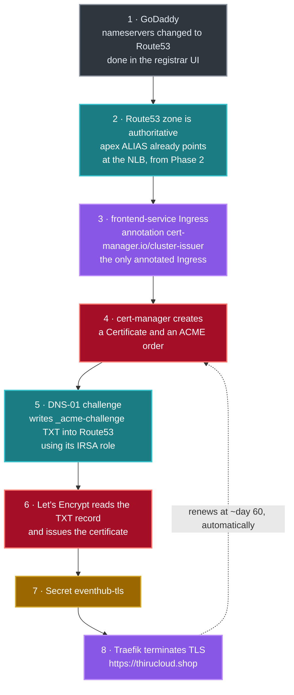

# Phase 5 — DNS Delegation and HTTPS (cert-manager + Let's Encrypt)

**Goal:** Point the GoDaddy nameservers at the Route53 hosted zone, install
**cert-manager** with the `cert-manager` Terraform module, and turn on TLS so
EventHub is served at **https://thirucloud.shop** with a real
certificate — issued and renewed automatically, with no manual steps ever again.

**Time:** ~10 minutes of work, plus DNS propagation (usually minutes,
occasionally hours).

---

## What this phase creates



**Why cert-manager and not ACM.** ACM's DNS validation blocks
`terraform apply` while it waits for a record to become visible in public DNS.
Request a certificate before delegation is live and Terraform hangs for the full
45-minute timeout and then fails. cert-manager is a controller — it retries in
the background and completes on its own. **Delegation and deployment stop being
coupled**, which is exactly what you want when the registrar is a manual step.

**Why DNS-01 and not HTTP-01.** DNS-01 works before the site is publicly
reachable, and it is the only challenge type that can issue a wildcard. It costs
one IRSA role scoped to a single hosted zone — already created in Phase 1.

---

## ✅ Prerequisites

| Need | How to check |
| --- | --- |
| Phase 1–4 complete, app reachable over HTTP | `curl -H "Host: $FQDN" http://$NLB/api/events` returns events |
| Route53 zone exists | `terraform output route53_zone_id` |
| cert-manager IRSA role exists | `terraform output irsa_role_arns` *(or check IAM for `eventhub-dev-eks-cert-manager`)* |
| Access to the GoDaddy account | You can sign in and edit nameservers |

---

## Step 1 — Get the nameservers

```bash
cd terraform/environments/dev
terraform output -raw delegation_instructions
```

or from the repository root:

```bash
make nameservers
```

You will get four names like:

```
ns-1234.awsdns-56.org
ns-789.awsdns-01.net
ns-2345.awsdns-78.co.uk
ns-90.awsdns-12.com
```

> ℹ️ Only the environment with `create_route53_zone = true` (dev) owns the zone.
> stage and prod reuse it via their own subdomains — across *environments* you
> delegate once.

> ⚠️ **A `terraform destroy` followed by a rebuild creates a brand-new hosted
> zone with brand-new nameservers.** Route53 does not reissue the same four.
> So every time you tear dev down and build it again, you must repeat Steps 1-3
> with the new values — the old ones at GoDaddy will point at a zone that no
> longer exists, and the domain will stop resolving entirely until you update
> them.
>
> If you plan to rebuild often, keep the zone out of the teardown: create it
> once by hand, then set `create_route53_zone = false` and let every environment
> look it up. `terraform destroy` then leaves DNS untouched and delegation
> really is one-time.

---

## Step 2 — Update the nameservers at GoDaddy

1. Sign in at <https://dcc.godaddy.com/control/portfolio>
2. Click **thirucloud.shop**
3. Scroll to **Nameservers** → **Change**
4. Choose **I'll use my own nameservers**
5. Replace all four entries with the ones from Step 1
6. **Save**

> ⚠️ **Enter the names exactly as printed, with no trailing dot.** GoDaddy
> rejects `ns-1234.awsdns-56.org.` — Route53 prints them without one anyway.

> ⚠️ **This moves *all* DNS for the domain to Route53.** Any existing GoDaddy
> records — email (MX), a website, verification TXT records — stop resolving
> unless you recreate them in the Route53 zone. If the domain is only for this
> project, there is nothing to worry about.

---

## Step 3 — Wait for delegation to propagate

```bash
watch dig +short NS thirucloud.shop @8.8.8.8
```

Wait until it returns the four AWS nameservers instead of GoDaddy's. Usually a
few minutes; occasionally up to an hour.

Then confirm the application record resolves:

```bash
dig +short thirucloud.shop
# k8s-traefik-….elb.us-east-1.amazonaws.com.
# 3.x.x.x
```

That ALIAS record was created back in Phase 2 by the `traefik` module — it has been
sitting in the zone, correct but unreachable, this whole time.

The site is now live over plain HTTP:

```bash
curl -s http://thirucloud.shop/api/events | head -20
```

No `Host` header needed any more — real DNS is doing the work.

> 🛑 **Do not continue until `dig` returns the AWS nameservers.** cert-manager's
> DNS-01 challenge is checked against *public* DNS. Starting early is harmless —
> it just retries — but you will spend the wait staring at a `False` certificate
> wondering what broke.

---

## Step 4 — Install cert-manager

```bash
cd terraform/environments/dev
terraform apply -target=module.cert_manager
```

or from the repository root:

```bash
make cert-manager
```

This creates the `cert-manager` namespace, installs the Helm chart with its CRDs
and the IRSA annotation, then installs a small local chart containing the two
ClusterIssuers.

The chart version is pinned in `terraform.tfvars`:

```hcl
cert_manager_chart_version = "v1.21.1"
```

> ℹ️ On charts older than v1.15 the CRD key is spelled `installCRDs: true`
> rather than `crds.enabled: true`. If you move the pin backwards, the module's
> values need that change too.

> 💡 **Why the issuers ship as a Helm chart.** They are cert-manager custom
> resources. `kubernetes_manifest` validates custom resources against the live
> cluster during `plan`, so it cannot create an object whose CRD will not exist
> until `apply` — a chicken-and-egg that makes the first run impossible. Helm
> templates locally and applies at apply time, so it sidesteps the problem
> entirely. See [modules/cert-manager/chart/](../../terraform/modules/cert-manager/chart/).

Verify:

```bash
kubectl get pods -n cert-manager
# cert-manager-…              Running
# cert-manager-cainjector-…   Running
# cert-manager-webhook-…      Running

kubectl get clusterissuer
# NAME                  READY
# letsencrypt-staging   True
# letsencrypt-prod      True
```

`READY=True` means cert-manager successfully registered an ACME account with
Let's Encrypt. If it is `False`, check the email address in `terraform.tfvars`.

Confirm the IRSA wiring:

```bash
kubectl get sa cert-manager -n cert-manager \
  -o jsonpath='{.metadata.annotations.eks\.amazonaws\.com/role-arn}'; echo
# arn:aws:iam::<acct>:role/eventhub-dev-eks-cert-manager
```

---

## Step 5 — Turn on TLS

Two flags in
[terraform/environments/dev/terraform.tfvars](../../terraform/environments/dev/terraform.tfvars):

```hcl
enable_tls                     = true
traefik_redirect_http_to_https = true

use_letsencrypt_staging = true      # leave true for the first issuance
```

Apply both modules — Traefik for the redirect, `k8s-app` for the Ingresses:

```bash
terraform apply -target=module.traefik -target=module.k8s_app
```

or:

```bash
make traefik && make app
```

What changes:

- Traefik's `web` entrypoint now permanently redirects to HTTPS on **port 443**
- Every Ingress moves to the `websecure` entrypoint and gains a `tls` block
  naming the Secret `eventhub-tls`
- **The `frontend-service` Ingress** — and only that one — gains
  `cert-manager.io/cluster-issuer: letsencrypt-staging`

> 💡 **Why only one Ingress carries the annotation.** cert-manager creates one
> `Certificate` per annotated Ingress. All five share a hostname and a Secret, so
> annotating all five would fire five simultaneous requests for the same name and
> exhaust the Let's Encrypt rate limit for no benefit. One Ingress requests the
> certificate; Traefik loads the resulting Secret into its certificate store and
> serves it for every router matching that hostname.

---

## Step 6 — Watch the certificate issue

```bash
kubectl get certificate -n eventhub -w
# NAME           READY   SECRET         AGE
# eventhub-tls   False   eventhub-tls   10s
# eventhub-tls   True    eventhub-tls   70s
```

The chain, if you want to watch each link:

```bash
kubectl get certificate,certificaterequest,order,challenge -n eventhub
```

```
Ingress (annotation)
  └─► Certificate  eventhub-tls
        └─► CertificateRequest
              └─► Order            (ACME order with Let's Encrypt)
                    └─► Challenge  (DNS-01)
                          └─► TXT record _acme-challenge.thirucloud.shop… in Route53
                                └─► Let's Encrypt verifies ──► Secret eventhub-tls
```

You can see the challenge record briefly appear in Route53:

```bash
ZONE=$(terraform output -raw route53_zone_id)
aws route53 list-resource-record-sets --hosted-zone-id "$ZONE" \
  --query "ResourceRecordSets[?Type=='TXT']" --output table
```

If it stalls, `make cert-status` prints the certificate description and any
outstanding challenges.

Typical issuance time is **30–90 seconds** once delegation is live.

---

## Step 7 — Test the staging certificate

```bash
curl -I http://thirucloud.shop/
# HTTP/1.1 301 Moved Permanently
# Location: https://thirucloud.shop/        <- no port. See the warning below.

curl -Ik https://thirucloud.shop/
# HTTP/2 200

curl -v https://thirucloud.shop/ 2>&1 | grep -i issuer
# issuer: C=US; O=(STAGING) Let's Encrypt; CN=(STAGING) …
```

`-k` is required: the staging root is **not trusted by browsers or curl**, by
design. Seeing `(STAGING)` in the issuer is proof the whole DNS-01 path works.

> ⚠️ **Check the redirect has no port in it.** Traefik listens on 8443 inside
> the container and never sees the Service's 443 → 8443 mapping, so if the
> redirect target is written as an entrypoint name it emits
> `Location: https://thirucloud.shop:8443/` — a port the load balancer does
> not listen on, so every browser following it hangs. The traefik module
> therefore sets the target as an explicit port:
>
> ```hcl
> "--entrypoints.web.http.redirections.entryPoint.to=:443"   # not "=websecure"
> ```
>
> This project hit exactly that during its first deployment. Always follow the
> redirect end to end rather than trusting the 301:
>
> ```bash
> curl -sIL -o /dev/null -w "final: %{http_code} at %{url_effective}\n" http://thirucloud.shop/
> # final: 200 at https://thirucloud.shop/
> ```

---

## Step 8 — Switch to production certificates

Only now, once you have watched a staging certificate reach `Ready=True`:

```hcl
# terraform/environments/dev/terraform.tfvars
use_letsencrypt_staging = false
```

```bash
terraform apply -target=module.k8s_app
```

The annotation flips to `letsencrypt-prod`. cert-manager notices the issuer
changed, requests a new certificate and replaces the Secret in place.

```bash
kubectl delete secret eventhub-tls -n eventhub   # force a fresh issuance
kubectl get certificate -n eventhub -w
```

Then, with no `-k`:

```bash
curl -I https://thirucloud.shop/
# HTTP/2 200
```

Open <https://thirucloud.shop> — a padlock, no warning.

> ⚠️ **Let's Encrypt production allows 5 duplicate certificates per registered
> domain per week.** There is no way to lift it early. This is exactly why
> Step 5 used staging first: debugging DNS against production burns that quota in
> an afternoon and locks you out until the window rolls forward.

---

## Step 9 — Run the full end-to-end test

```bash
make smoke-cluster
```

> ⚠️ **If step 0 fails with "frontend-service is not healthy" but `curl` works
> by hand**, something local is resolving the domain to the wrong address.
> A stale `/etc/hosts` entry is the usual culprit and survives every DNS cache
> flush, because it never reaches DNS at all:
>
> ```bash
> grep vijaygiduthuri /etc/hosts          # if this prints anything, that is your problem
> resolvectl query thirucloud.shop      # "Data from: synthetic" confirms /etc/hosts
> sudo sed -i '/vijaygiduthuri\.in/d' /etc/hosts
> ```
>
> To test regardless, pin the address — this also works before DNS has
> propagated at all:
>
> ```bash
> IP=$(dig +short thirucloud.shop @8.8.8.8 | head -1)
> BASE_URL=https://thirucloud.shop RESOLVE_IP=$IP ./scripts/smoke-test.sh
> ```

Eight checks against the live HTTPS endpoint: catalogue, a confirmed booking,
inventory decrement, a declined card, **compensation restoring the seats**,
notifications, cancellation with refund, and a rejected double-cancel.

```
  ✓ frontend-service is healthy
  ✓ 6 events; using 'Indie Film Premiere' with 180 seats free
  ✓ booking bkg_… confirmed with payment pay_…
  ✓ seats went 180 -> 178
  ✓ declined card rejected with 402
  ✓ inventory still 178; no seats leaked by the failed booking
  ✓ 2 notifications in the feed
  ✓ booking bkg_… cancelled
  ✓ inventory restored to 180
  ✓ repeat cancellation rejected with 409, so no double refund
```

---

## Renewal

Nothing to do. cert-manager renews at **two-thirds of the certificate lifetime**
— around day 60 of Let's Encrypt's 90 — using the same DNS-01 solver. The Secret
is replaced in place and Traefik picks it up without a restart.

Check anytime:

```bash
kubectl get certificate eventhub-tls -n eventhub \
  -o jsonpath='{.status.notAfter}'; echo
```

---

## Adding stage and prod

They share the same hosted zone, so **no further registrar work is needed** —
`eventhub-stage` and `eventhub` are just more records in a zone that already
resolves.

```bash
make ENV=stage init
make ENV=stage infra
make ENV=stage apps          # cert-manager, Traefik and the app, in order
```

Their tfvars already set `create_route53_zone = false`, `enable_tls = true`,
`traefik_redirect_http_to_https = true` and `use_letsencrypt_staging = false` —
by the time you build them, dev has proved the path works.

---

## Troubleshooting

| Symptom | Likely cause | Fix |
| --- | --- | --- |
| `dig NS` still returns GoDaddy | Delegation not propagated | Wait. Confirm the four names at GoDaddy match `terraform output route53_name_servers` exactly. |
| GoDaddy rejects a nameserver | Trailing dot | Remove it — enter `ns-1234.awsdns-56.org`. |
| Email stopped working after delegation | MX records lived at GoDaddy | Recreate them in the Route53 zone. |
| `ClusterIssuer` `READY=False` | ACME registration failed | `kubectl describe clusterissuer letsencrypt-staging`. Usually an invalid `acme_email`. |
| Certificate stuck `False`, challenge `pending` | Public DNS cannot see the zone yet | `dig +short NS thirucloud.shop @8.8.8.8` — wait for delegation. |
| Challenge fails with `AccessDenied` on Route53 | cert-manager IRSA not wired | Check the `role-arn` annotation on the `cert-manager` service account, and that `securityContext.fsGroup: 1001` is set (the module sets it — without it the token file is unreadable and the error looks like missing credentials). |
| Certificate issues, but the browser still warns | Staging issuer | Step 8 — set `use_letsencrypt_staging = false`. |
| `too many certificates already issued` | Production rate limit exhausted | No way to lift it; wait for the week to roll. Use staging while debugging. |
| `https://` → `404` | Ingress host does not match the URL | `kubectl get ingress -n eventhub` and compare with `terraform output app_fqdn`. |
| `https://` → Traefik default self-signed cert | Secret `eventhub-tls` missing or empty | `kubectl get secret eventhub-tls -n eventhub`; if absent, the Certificate has not issued — go back to Step 6. |
| Redirect goes to `https://host:8443/` and hangs | Traefik's container port leaked into the public redirect | The module sets `redirections.entryPoint.to=:443`. If you overrode `additional_arguments`, keep the explicit port. |
| Smoke test fails but manual `curl` works | A stale `/etc/hosts` entry, or a resolver answering incorrectly | `grep vijaygiduthuri /etc/hosts`; or pin with `RESOLVE_IP=…`. See Step 9. |
| Ingress still answers on the old hostname after changing `subdomain` | Only `module.traefik` was re-applied | The Ingress hosts come from `module.k8s_app`. Apply both: `terraform apply -target=module.traefik -target=module.k8s_app`. |
| `http://` no longer redirects | `traefik_redirect_http_to_https` still false | Set it true and `terraform apply -target=module.traefik`. |
| Certificate did not renew | cert-manager not running, or IRSA revoked | `kubectl get pods -n cert-manager`; `kubectl describe certificate eventhub-tls -n eventhub`. |

---

## 🎉 You're done

EventHub is live at **https://thirucloud.shop** — five Go
microservices on EKS, images built and scanned by CI, every piece of
infrastructure defined in Terraform, and TLS that renews itself.

**Remember to tear it down when you are finished** — an idle environment is
about $8/day:

```bash
make destroy
```

---

⬅️ **Back to:** [Phase 4 — Deploy EventHub](04-eventhub-app-deploy.md) ·
📖 **Index:** [docs/aws/README.md](README.md)
