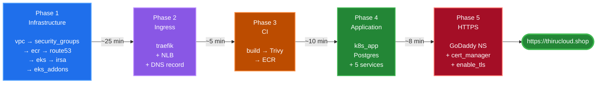

# Deploying EventHub to AWS

Five phases, in order, from an empty AWS account to
**https://thirucloud.shop** serving a real application with a
real certificate.

Each phase is self-contained: prerequisites, what it builds, the exact commands,
how to verify, and a troubleshooting table. Follow them in order the first time.

| Phase | Doc | What you get | Time |
| --- | --- | --- | --- |
| **1** | [01-aws-infra.md](01-aws-infra.md) | VPC, security groups, ECR, Route53 zone, EKS cluster, IRSA roles, add-ons | ~25 min |
| **2** | [02-traefik.md](02-traefik.md) | Traefik ingress controller behind a Network Load Balancer, plus its DNS record | ~5 min |
| **3** | [03-github-actions.md](03-github-actions.md) | CI that builds, Trivy-scans and pushes all five images to ECR | ~10 min |
| **4** | [04-eventhub-app-deploy.md](04-eventhub-app-deploy.md) | PostgreSQL on EBS and all five services, reachable over HTTP | ~8 min |
| **5** | [05-https.md](05-https.md) | GoDaddy delegation, cert-manager, Let's Encrypt, HTTPS | ~10 min + DNS |

---

## The whole thing at a glance



Every `make` target defaults to `ENV=dev`. Add `ENV=stage` or `ENV=prod` to work
on another environment.

---

## Everything you do by hand

Phases 1 to 4 are **pure copy-paste** — every step is a command, and nothing in
the repository needs editing. All the manual work is in Phase 5, and it is four
things:

| # | What | Where | Phase |
| --- | --- | --- | --- |
| 1 | `aws configure` with your access key | your terminal | before Phase 1 |
| 2 | Point the domain's nameservers at Route53 | GoDaddy web UI | 5, Step 2 |
| 3 | `enable_tls = true` and `traefik_redirect_http_to_https = true` | `environments/dev/terraform.tfvars` | 5, Step 5 |
| 4 | `use_letsencrypt_staging = false` | same file | 5, Step 8 |

Items 3 and 4 are three lines in one file. Nothing else in the repository is
edited at any point.

> **Why these are not automated.** Each waits on something Terraform cannot:
> DNS propagating after a change you make at a registrar, and a certificate
> issuing once against a live domain. Automating them would produce an apply
> that hangs or fails on someone else's timing — exactly the ACM problem
> cert-manager was chosen to avoid.

If you are deploying into a **different AWS account** than this repo was built
in, there is one more: change the `bucket =` line in all three
`terraform/environments/*/backend.tf`. See Phase 1, Step 0.

---

## Why the applies are staged

The Kubernetes and Helm providers are configured from `module.eks` outputs,
which do not exist on a brand-new environment — and Terraform configures every
provider *before* it builds the graph. So an untargeted `terraform apply` on an
empty environment fails.

`-target` prunes the graph: targeting `module.vpc` puts no Kubernetes resources
in the plan, so that provider is never configured at all.

**This only applies to the first run.** Once everything is in state, the cluster
endpoint is known and a plain `terraform apply` works normally — which is what
you use for every change afterwards.

---

## Order matters in two places

**Phase 2 before Phase 4.** The application's Ingresses reference Traefik's
IngressClass, so the controller has to exist first.

**Phase 4 before Phase 5, not the other way around.** The application deploys
perfectly well without cert-manager — the `frontend-service` Ingress simply
carries an annotation nothing is watching yet. Install cert-manager afterwards
and it picks that annotation up on its next resync. This is deliberate: it lets
you prove the application works over plain HTTP *before* adding TLS and DNS to
the list of things that could be wrong.

---

## Two flags stay off until Phase 5

In `terraform/environments/dev/terraform.tfvars`:

```hcl
enable_tls                     = false
traefik_redirect_http_to_https = false
```

Turning either on early makes the application unreachable before DNS is
delegated — the redirect sends every request to a hostname that does not
resolve, and TLS puts an Ingress in front of a certificate nothing can issue.
Phase 5 turns both on in one step.

stage and prod ship with both already `true`, because by the time you build them
dev has proved the path works.

---

## Cost while you follow along

| | dev / stage | prod |
| --- | --- | --- |
| EKS control plane | ~$73/mo | ~$73/mo |
| Nodes | ~$120/mo (2 × t3.large) | ~$180/mo (3 × t3.large) |
| NAT gateway | ~$33/mo (1) | ~$99/mo (3) |
| Network Load Balancer | ~$17/mo | ~$17/mo |
| EBS, ECR, Route53 | ~$10/mo | ~$20/mo |
| **Total** | **~$250/mo · ~$8/day** | **~$390/mo · ~$13/day** |

```bash
make destroy    # workloads first, then the cluster, then the VPC
```

> ⛔ **Not `terraform destroy` on its own.** Helm can only uninstall while nodes
> still exist, and Terraform's dependency graph does not know that. If the node
> group goes first, the Helm releases stall and the Network Load Balancer is
> orphaned — it was created by a controller, not by Terraform, so it is not in
> state and nothing left running can delete it. A live NLB holds ENIs, so the
> VPC then cannot delete either.
>
> `make destroy` sequences it correctly and now refuses to touch the cluster
> while a load balancer is still up. Recovery steps for a half-finished destroy
> are in [Phase 1](01-aws-infra.md).

---

## Related documentation

- [**../../README.md**](../../README.md) — project overview, local development, repository layout

Each phase doc ends with its own troubleshooting table, organised by the symptom
you would actually see.
